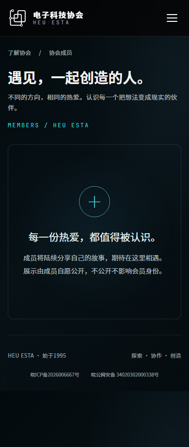
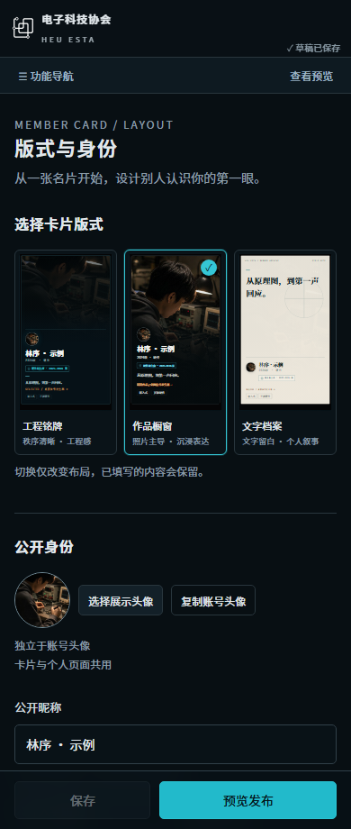
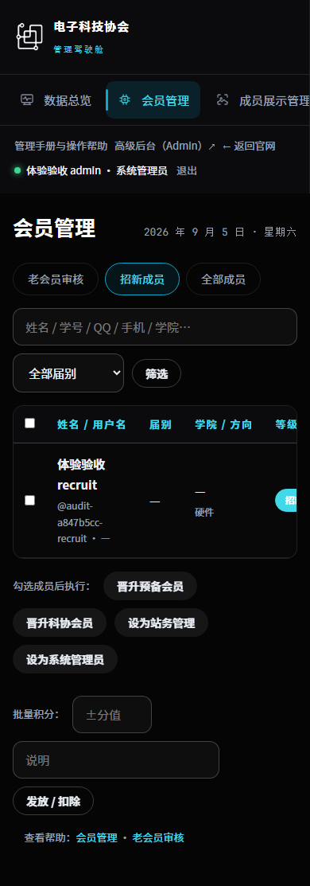
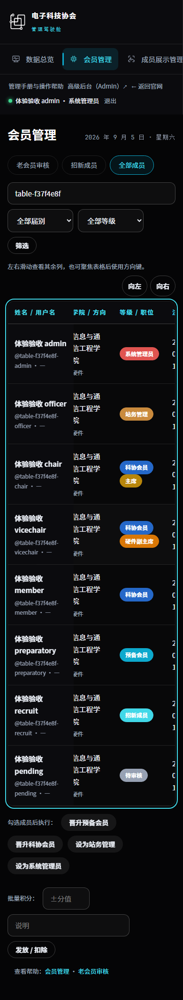
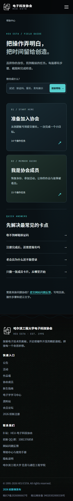

# 全站体验审计与开发路线图

核验日期：2026-09-05。生产基线：`9c9b9e8`。候选分支：`codex/fullsite-experience-help-20260905`。

## 结论与发布状态

本轮是分阶段改进，不是全站重做。候选版本已经实现成员展示 v4、任务式帮助中心、用户名扩展、批量晋升保护、勋章查找修复、返回地址保护与手机后台表格改进；**尚未部署到正式站，整个计划未完成**。

最重要的已确认问题不是颜色或卡片样式，而是批量“晋升”可能把高等级账号降到预备会员或科协会员。修复已独立提交，新增回归覆盖权限保护、异常输入与站外跳转。应优先完成该修复的发布，而不是等所有视觉工作一起上线。

正式站此次只做只读巡检。未新建生产演示账号，未变更真实成员、职位、内容、邮箱或论坛，未执行服务器升级和部署。

## 证据与方法

| 编号 | 范围 | 已获得的证据 | 不能据此声称的结论 |
| --- | --- | --- | --- |
| Q01 | 主站后端 | PostgreSQL CI 643 项测试全部通过，无跳过；包含并发保存与停用竞争 | 不等于压力测试、渗透测试或全部生产配置已验 |
| Q02 | 成员展示与帮助 | 49 组浏览器检查；五档宽度 1440、1024、768、390、320；卡片单独发布、草稿隔离、撤回、保存失败与恢复 | 还没有真实成员可用性访谈 |
| Q03 | 跨角色 | 35 个路径 × 9 种身份，共 315 组 HTTP 权限核对；另有 4 项勋章授予至通知阅读流程；26 张桌面/手机截图；6 项后台表格交互检查 | 还没有覆盖每一个后台写操作；不能把路径检查称为完整流程 |
| Q04 | 注册 | 新老通道、分步校验、验证码反馈、中文及兼容符号用户名、无脚本退化、手机布局 | 测试邮箱为本地后端，不证明真实邮件投递质量 |
| Q05 | 无障碍 | 跳转正文链接、键盘焦点、消息层级、内页转场结束后的命中、文字对比度及窄屏验证 | 两处图片/渐变底色对比度未自动计算，不能当作通过 |
| Q06 | 性能 | CSS/JS/字体预算、按页加载、首屏外图片延迟加载、减少动效时不加载 3D 包 | 本地时间不等于校园网或低端手机的真实 Web Vitals |
| Q07 | 正式站健康 | 12 个公共页面、125 个图片资源只读访问通过 | 未写入生产数据库，未验证私密操作及实时邮箱投递 |
| Q08 | 论坛相关 | 公共邮箱插件 24 项测试；主站 SSO 签名与等级测试 | 尚缺隔离 NodeBB 的真实登录、组同步和 IMAP 端到端验证 |
| Q09 | 离线手册 | 三册由网页同源 Markdown 导出；新增内部章节跳转、页码、返回目录与图片说明 | DOCX/PDF 仍在分页与逐页视觉验收，不是定稿 |

Q01 首次实际通过记录：GitHub Actions run `33944235497` 的 Django 测试步骤。该次工作流整体仍因静态预检前缺少独立本地数据库而失败；不能把单步骤通过写成整条 CI 通过。

最新应用代码验收记录：提交 `638e8a4` 的 [GitHub Actions run 33946069356](https://github.com/sijiaohanshusin/web/actions/runs/33946069356) 两项作业全部成功。PostgreSQL 643 项、迁移、生产静态管线、浏览器、性能预算与插件测试均执行通过。截图与结果文件已上传 CI 证据包，不包含测试数据库、Cookie 或日志。后续提交仍须重跑，不能沿用旧提交的绿灯代替检查。

可复现入口：

```text
# 在 app 目录运行，不能在仓库根直接测试，否则可能发现 0 项。
python manage.py test --noinput
python manage.py test core.test_role_contracts helpcenter --noinput

# 在仓库根运行；浏览器写入只作用于本地测试库。
python scripts/check_roles.py
python scripts/check_dashboard.py
python scripts/check_management.py
python scripts/check_experience.py
python scripts/check_register.py
python scripts/check_a11y.py
python scripts/check_pages.py
python scripts/check_perf.py
python scripts/preflight.py --candidate
```

截图与机器结果分别保存在 `.shots/roles/`、`.shots/experience/` 和各检查日志中。它们是可重建证据，不是生产数据备份。

## 页面 角色 设备 核心任务矩阵

角色缩写：G 游客；R 招新成员；P 预备会员；M 科协会员；V 副主席；C 获授权主席；O 站务；A 系统管理员。待审核账号不得登录。普通副主席与普通科协会员的管理权限一致，不能凭职位文字获得授权。

设备：D 桌面 1440；T 平板 1024/768；S 手机 390/320。表中“后端”仅代表 Django 请求/服务测试，“浏览器”才代表真实浏览器动作。

| 页面或流程 | 对象 | 核心任务与检查范围 | 设备与证据 | 下一项验收 |
| --- | --- | --- | --- | --- |
| 首页 `/` | G–A | 招新入口、导航、图片、减少动效 | D/S 浏览器，生产只读 | 真实弱网首屏与失效外部视频 |
| 新生指南 `/recruit/` | G–A | 阅读目录、方向介绍、长页资源 | D/S 浏览器与预算 | 真实手机长页返回位置 |
| 注册入口及两个通道 | G、待审核 | 固定身份选项、验证码、用户名、隐私同意 | D/S 浏览器与后端 | 真实邮箱投递只读观察与运营反馈 |
| 登录、验证码登录、找回密码 | 所有账号 | 成功/失败、跳转目标、错误信息 | D/S 浏览器、后端 | 邮件延迟和会话过期的用户测试 |
| 招新 `/recruitment/` | G/R/P/M | 报名资格、必填、重复报名、进度 | D/S 浏览器及后端状态流转 | 隔离浏览器内完整一面二面链 |
| 公告 `/news/` 与详情 | G–A | 分类、分页、可见等级、未发布预览、发布与撤回 | 隔离真实浏览器，O写入/G/R/M读取 | 定时到达边界与真实校园网络缓存验收 |
| 活动 `/events/` 与详情 | G–A，报名 P+ | 时间、人数、报名、签到、取消 | 路径矩阵及后端 | 手机扫码签到和满额竞争浏览器验收 |
| 资料 `/resources/` 与下载 | 按内容等级 | 检索、分级、下载、越权拒绝 | 路径矩阵及后端 | 大文件中断与手机下载反馈 |
| 项目 `/projects/` | P+ | 项目成员、文件夹、附件、授权 | 路径矩阵及后端 | 隔离账号跨成员协作点验 |
| 公开作品 `/works/` | G–A | 公开/私密分离、封面、详情 | 公共巡检、后端、性能 | 多种真实长作品内容视觉复核 |
| 荣誉 `/honors/` | G–A | 展示与记录读取 | 路径矩阵及后端 | 证书图片逐张隐私复核 |
| 成员墙 `/team/` | G–A | 空状态、有效筛选、搜索、卡片/详情 | D/T/S 浏览器，Q02 | 真实成员自愿发布后的密度观察 |
| 个人展示详情 | G–A，内容本人开启 | 卡片单独发布时 404；旧数据兼容 | D/T/S 组件验收及后端 | 完整长文、图集、空图片集逐屏复核 |
| 展示编辑器 | 已激活 M+ | 五任务区、自动保存、双预览、发布、撤回 | D/T/S 浏览器，Q02 | 真实成员首次完成耗时与误操作观察 |
| 个人中心及资料 | 已登录账号 | 档案、资格、展示状态、编辑入口 | D/S 角色截图、后端 | 移动端信息减重与空模块收起 |
| 通知与个人积分 | 通知 R+，积分 P+ | 所有权、已读、积分流水、返回地址 | 勋章通知链浏览器、路径矩阵及后端 | 继续串联招新、积分与反馈通知 |
| 问题反馈 | G–A，私密详情受限 | 提交、查看自己的工单、回复通知 | 后端、角色检查 | 失败重试及手机完整对话链 |
| 管理总览 | C/O/A | 指标、待办、导航、图表 | D/S 角色截图 | 指标口径说明与大数据量 |
| 会员与老会员审核 | C/O/A | 搜索、审核、晋升、积分、拒绝保留 | D/S 截图、晋升回归 | 改动前后对照与批量确认 |
| 招新管理 | C/O/A | 批次、答卷、状态、CSV | 路径矩阵、后端 | 隔离浏览器从报名到审核全链 |
| 公告及活动管理 | C/O/A | 新建、权限、发布、名单 | D/S 部分截图、后端 | 所有写入操作与撤回点验 |
| 资料及项目管理 | C/O/A | 上传、公开范围、成员维护 | 路径矩阵、后端 | 网络中断和重复上传恢复 |
| 荣誉及素材管理 | C/O/A | 上传、槽位、裁切焦点 | 路径矩阵、现有专项测试 | 真实素材替换的回退验证 |
| 展示内容管理 | C/O/A | 下架原因、解除限制不自动公开 | 后端权限与发布回归 | 隔离浏览器管理/本人双会话 |
| 职位、任期、勋章 | A | 候选搜索、任命、历史、卸任、按学号授勋、重复保护 | D/S 截图、勋章真实表单及通知链、专项回归 | 手机任命长姓名与多结果 |
| 站点设置及高级后台 | A | 只读核查关键入口 | D/S 截图、角色矩阵 | 部署时只读检查；不做生产演示修改 |
| 三类帮助与搜索 | G–A，内部按 C/O/A 分层 | 找任务、检查点、目录、图片保护 | D/T/S 浏览器，逐篇路由测试 | 全文按钮核验、三册离线定稿 |
| 论坛 SSO 与公共邮箱 | P+，邮箱按论坛组 | JWT、组映射、只读邮件档案、首帖和回复审核 | 隔离 NodeBB 4.14.0 + PostgreSQL，30项真实浏览器与归档检查 | 真实IMAP传输、服务器主动会话撤销及其它版务操作 |
| CDN、证书、备份、部署 | 运维 | 公网可达、缓存头、回滚 | 本轮仅公共只读访问 | 分阶段发布前备份与回滚演练 |

## 八维评分与设计判断

采用 1–5 分工程评审量表：1 为核心任务受阻，2 为明显摩擦，3 为可用但需改善，4 为当前检查范围内稳定清晰，5 需真实用户验证且无突出问题。**“待验”不换算成分数，不计算容易掩盖缺项的总平均分。** 这不是用户满意度调查或安全认证。

列顺序：视觉一致性、任务效率、移动端、无障碍、性能、权限隐私、容错、可维护性。性能分只来自已有预算页面；其它页面不凭体感打分。

| 页面域 | 视觉 | 任务 | 移动 | 无障碍 | 性能 | 权限 | 容错 | 维护 | 主要判断 |
| --- | --- | --- | --- | --- | --- | --- | --- | --- | --- |
| 首页与指南 | 4 | 3 | 3 | 3 | 3 | 4 | 3 | 3 | 品牌明确，长页和字体负担仍重 |
| 注册与登录 | 4 | 4 | 4 | 3 | 3 | 4 | 4 | 4 | 三段任务清晰，用户名规则已一致 |
| 招新报名 | 4 | 3 | 3 | 3 | 待验 | 4 | 4 | 3 | 信息量较大，应实测填表中断恢复 |
| 公告 | 4 | 4 | 4 | 3 | 3 | 4 | 3 | 4 | 列表清晰，后台生命周期点验待补 |
| 活动与签到 | 待验 | 3 | 待验 | 待验 | 待验 | 4 | 4 | 3 | 后端覆盖较好，手机实操不足 |
| 资料与项目档案 | 3 | 3 | 待验 | 待验 | 待验 | 4 | 3 | 3 | 权限边界明确，文件操作恢复待补 |
| 公开作品与荣誉 | 4 | 3 | 3 | 待验 | 3 | 3 | 3 | 3 | 保留照片优势，逐图隐私需要人工 |
| 成员墙 | 4 | 4 | 4 | 3 | 待验 | 4 | 4 | 4 | 空墙不暴露复杂筛选，不制造假成员 |
| 展示编辑器 | 4 | 4 | 4 | 3 | 待验 | 4 | 4 | 4 | 五任务区及自动保存降低门槛；仍需真实用户测试 |
| 个人展示页 | 4 | 3 | 3 | 待验 | 待验 | 4 | 4 | 4 | 装饰减重，长图文验收尚未全覆盖 |
| 个人中心 | 3 | 3 | 3 | 待验 | 待验 | 4 | 3 | 3 | 手机页偏长，空模块与入口可精简 |
| 通知 积分 反馈 | 待验 | 3 | 待验 | 待验 | 待验 | 4 | 4 | 3 | 单项后端可用，跨流程呈现待验 |
| 管理总览 | 3 | 3 | 3 | 待验 | 待验 | 4 | 3 | 3 | 导航可用，手机横向导航发现性不足 |
| 管理列表与表单 | 3 | 3 | 3 | 3 | 待验 | 4 | 4 | 3 | 手机表格已有滚动提示、按钮与键盘操作；会员关键列固定，复杂后台流程仍待全链验收 |
| 职位与任期 | 3 | 4 | 3 | 3 | 待验 | 4 | 4 | 4 | 搜索与任期完整；页首说明块仍偏密 |
| 站点设置 | 3 | 3 | 3 | 待验 | 待验 | 4 | 3 | 3 | 不应为演示随意修改外部服务配置 |
| 网页帮助 | 4 | 4 | 4 | 3 | 待验 | 4 | 4 | 4 | 搜索与任务优先，不再以下载大部头为入口 |
| 离线手册 | 4 | 4 | 待验 | 待验 | 不适用 | 4 | 不适用 | 4 | 三册首次版各12页，局部截图、任务跳转和逐页复核；手机PDF阅读器交互仍需用户试读 |
| 论坛与邮箱 | 待验 | 待验 | 待验 | 待验 | 待验 | 3 | 3 | 3 | 单元测试不足以替代部署形态验证 |

## 问题清单

| 编号 | 级别 | 复现与影响 | 当前处理 | 验收条件与回归 |
| --- | --- | --- | --- | --- |
| AUTH-01 | P1 | 站务批量选择高等级账号并点击“晋升科协会员”，原逻辑可能降低账号等级；也缺独立后台账号保护 | `5353ae3` 已修，尚未发布 | 高等级不降级，独立后台账号不可被普通站务改动；`MemberActionTests` |
| AUTH-02 | P2 | 注册说明限制 ASCII，中文用户名无法提交；用户预期与实际不符 | `6ab5642` 支持中文和 `. - + _`，保留论坛兼容边界 | 两通道、NFKC 重名、长度、符号、登录、SSO、候选搜索；`accounts.test_usernames` |
| AUTH-03 | P2 | 通知、反馈和部分后台操作直接使用表单的 `next`，可跳向站外；普通非 URL 输入可触发错误或错误路径 | `638e8a4` 统一同站 URL 校验，拒绝控制字符、反斜杠和 HTTPS 降级；不改变操作权限 | 7 个 POST 路径、通知目标、登录退出，保留站内查询参数；`core.test_return_urls` 7 项多案例回归 |
| SHOW-01 | P2 | 空成员墙先要求搜索筛选，编辑器同时呈现全部设计参数 | v4 空状态、有效筛选、五任务区、渐进展开 | 五档截图；`check_experience` |
| SHOW-02 | P2 | 只想公开卡片也必须准备个人页；保存时锁定编辑可能打断输入 | 独立发布范围、非阻塞自动保存、失败暂停与冲突处理 | 卡片可见但详情404；隐藏模块不公开；保存竞态和撤回测试 |
| HELP-01 | P2 | 文档需从头通读，截图小，离线目录跳网页 | 45 篇网页任务、搜索、检查点、图片放大；离线内部目录已加入 | 按角色过滤标题/正文/图片；三册逐页视觉验收仍待完成 |
| PERF-01 | P2 | 六档字体同时预加载、核心 CSS 预算漂移 | 全局只预加载两档正文，拆分认证页样式 | 当前预算通过；真实字体仍约4.1–4.6MB，不能称全部负担已消除 |
| QA-01 | P1 | 无持续集成，SQLite 会跳过行锁竞争；测试从错误目录运行可能发现0项 | PostgreSQL CI、正确 app 工作目录、浏览器及插件门槛 | 643 项实际执行，CI整体全绿后才进入发布 |
| QA-02 | P2 | 测试在跨页动画未结束时点验，误报消息被覆盖 | 等待真实 View Transition finished；保留命中断言 | `check_a11y`，不以删除断言消除失败 |
| ADMIN-01 | P2 | 手机后台表格只露出前几列，看不出可横向滚动；全局页面宽度检查却会通过 | `14a10a6` 加滚动提示与左右按钮、方向键及 Home/End；会员身份列固定；无溢出时隐藏控制项 | `check_dashboard.py` 五档宽度及禁用脚本，验证勾选保留、边界禁用、聚焦可见和无整页溢出；其它复杂表格仍需逐项人工核验 |
| ADMIN-02 | P1 | 勋章界面提示用户名/学号，后端却按内部主键查找，学号404、中文用户名500；超长理由缺服务端校验 | `86b5113` 复用精确身份解析，拒绝重名猜选；错误保留输入；理由限制200字 | `MedalGrantTests` 10项，用户名/姓名/学号/#ID、重复通知、越权与HTML转义；本地真实浏览器4项链路 |
| ADMIN-03 | P2 | 新公告不勾选已发布仍提示发布成功；未来发布时间在列表显示已发布 | `df5e04e` 保存按钮与消息区分未发布、待定时和已发布；公开访问规则未改 | `NewsWorkflowTests` 6项；浏览器完整预览、发布、范围修改及撤回 |
| MOTION-01 | P2 | 减少动效仅关闭动画，跨页转场仍启动；快速表单导航出现无堆栈的 Transition was skipped | 仅在无减动效偏好时启用跨文档转场，不过滤浏览器错误来掩盖问题 | 同一浏览器流程红到绿；检查 reduced-motion 下没有 viewTransition 对象 |
| DOC-01 | P2 | 离线自动排版出现少量内容独占下一页，界面缩图需放大 | 修正桌面局部图误判为手机图、保留源稿图注、合并章末返回目录避免孤页；新增结构校验与缩图复核队列 | 每页100%检查仍待完成；自动检查不是视觉验收，不把导出成功当定稿 |
| FORUM-01 | P1 | 主站退出或刷新降级身份后，论坛旧会话仍沿用原身份 | 候选配置改为 revalidate，下一次论坛整页请求重新核对主站 Cookie | 隔离六角色 SSO、刷新主站身份后降级、主站退出；不声称跨会话立即撤销所有旧令牌 |
| FORUM-02 | P2 | 公共邮箱露出内部排版标记，原样预览没有生成 | 插件1.2.2兼容带方向属性的段落与旧合并标记，不重写历史邮件 | 28项插件测试；实际论坛 iframe 正文、沙箱与纯文本展开验证 |
| FORUM-03 | P2 | 新用户提交主题或回复后进入审核队列，旧帮助只有登录说明，容易被误认为发布失败 | 补充桌面/手机首帖、回复、等待审核与论坛管理员接受的完整步骤及合成截图 | 真实编辑器写入、实际队列接受、主题结果核对；不关闭审核来简化演示 |
| PAGE-01 | P3 | 个人中心空模块多、职位页说明密集、深色后台长表难扫描 | 进入下一批设计，不与权限修复混发 | 真实用户可快速找到首要任务，不丢失档案字段和权限说明 |

目前未确认 P0 漏洞。此结论只涵盖已经检查的范围，不能写成“网站不存在安全问题”。

## 视觉证据

以下均为隔离环境或虚构测试成员，不是生产公开成员。



空墙保留协会语气与公开自主权说明，隐藏无意义筛选。不会为了填满页面而公开演示账号。



底部操作始终可达，模板不是九步必填表单。复杂参数放在对应任务内部。



上图为优化前基线：表格右侧列需要滑动才能看到，页面却没有足够明显的提示。



优化后增加滚动提示和44px操作按钮，键盘可以控制横向滚动。姓名列随表格滚动保持可见，复选框选择不会丢失。不把这项修复等同于所有后台页面都已完成移动端改版。



主要入口改成按身份和任务查阅；首次使用路线按同一文章库组织。根据最新确认，PDF 改为短篇首次引导，旧完整手册只作历史参考。

## Now Next Later

### Now 发布前必须完成

1. CI 整体全绿，保留 PostgreSQL、迁移、生产静态管线、真实浏览器和 NodeBB 插件测试，不接受0项测试或静默跳过。
2. 优先发布 AUTH-01 等安全边界修复；先备份与核验 main 的生产基线，不能直接把整条候选分支当紧急修复。
3. 成员展示 v4 完成旧数据兼容、素材权限、仅卡片公开、撤回和失败恢复验收；分阶段启用，不自动公开。
4. 帮助中心逐章核对实际功能。PDF 三册改为首次注册、完善资料、开始会员或管理操作的短篇路线，补齐局部截图与逐页验收后再定稿，不继续精修105页旧全文镜像。网页先作为主入口。
5. 补齐隔离论坛与后台核心写入的端到端测试；生产仍仅只读。

### Next 第一轮真实用户反馈之后

1. 在已加入滚动提示的基础上，继续完善手机后台复杂列表，批量操作增加对象摘要、数量确认和结果对照。
2. 观察新成员填写报名和制作第一张名片的真实耗时，按卡点调整，而不是增加更多模板和参数。
3. 字体按字形频率与页面族拆分，先量化缓存命中和中文缺字，再确定子集方案；不牺牲可读性换预算数字。
4. 精简个人中心空模块与重复入口；把申请、通知、资料和展示状态组织为“当前需要做什么”。
5. 统一附件上传失败、后台筛选空结果、验证码延迟和权限过期的反馈文案。

### Later 稳定后再考虑

1. 引入真实用户性能观测与可用性反馈统计，先做好隐私最小化与保留期限。
2. 根据使用数据决定是否新增作品模板、协作功能或更复杂搜索，不预先扩展后台 CMS。
3. 对关键管理变更考虑更完整的审计日志与两人复核；不把组织职位文字当作新的授权来源。

## 分阶段交付清单

| 阶段 | 候选实现 | 本地/CI验收 | 生产发布 |
| --- | --- | --- | --- |
| 质量基线及 P1 | 已实现 | `638e8a4` 完整CI通过，643项PostgreSQL测试 | 未发布；备份/回退未演练 |
| 成员展示 v4 | 已实现 | 浏览器核心流程已通过，真实成员测试待做 | 未发布 |
| 三类网页帮助 | 已实现 | 权限/多设备通过；三册首次上手验收版完成 | 未发布 |
| 其余 P2 | 部分完成 | 手机表格与返回地址已修；外部论坛、弱网和其它后台写入仍有缺口 | 未发布 |

不能把候选分支推送、单项测试通过或文档导出成功当作整套计划已完成。每次发布后还需核查 HTTPS、CDN 缓存、受保护素材、备份任务和可回退版本；原主站发布不重启论坛，不恢复已撤回内容。论坛配置及插件修复属于单独发布范围，需明确确认并备份后才能更新。

## 2026-09-05 首次引导与后台写入推进

- 用户已认可当前预览外观；PDF 后续聚焦首次引导，不等于已经确认整套功能可以跳过发布验收。
- 新增 `onboarding.json` 五阶段路线；网页只引用原文章，管理员路线在渲染前去除无权查看的系统章节。普通注册者也能从路线找到私有资料编辑说明。
- `check_management.py` 新增20项真实浏览器检查：11项公告/老会员/资料/减动效流程，9项三类路线在1440/390/320px下的键盘展开、无溢出与权限过滤。所有写入只作用于固定隔离SQLite，虚构账号及公告在finally清理，不发送真实邮件。
- 公告链：无效表单保留正文 → 保存未发布 → 管理预览 → 发布供游客/招新/会员阅读 → 改为科协会员可见 → 下架后原有读者也不可读。未篡改业务权限来通过测试。
- 老会员链：待审核不能登录 → 站务纠正申报身份并批准 → 手机首次登录 → 自定义方向缺说明报错 → 修正并保存 → 仍无管理权限。这一链的起点是隔离申请夹具，不冒称本脚本也走完了注册及真实邮件投递。
- 修正公告帮助中“直接预览”的模糊说明，明确先取消发布勾选并保存，再从列表预览。补充当前界面的局部图，旧私有资料图不再整页缩小。
- 本地Django共651项通过、2项PostgreSQL专属测试跳过；字体字形及预算通过。候选HEAD仍须完整CI验证，之前643项的绿灯不覆盖本轮新代码。
- 论坛历史材料只有SSO与只读版块截图，不包含实际发帖/回复链。本次不把它写成已验收功能，也没有在正式站制造测试主题。隔离NodeBB/IMAP、其它后台写入、精简PDF逐页验收与生产备份/回退仍是剩余事项。

浏览器转场机制核对依据：[Chrome 跨文档 View Transitions 文档](https://developer.chrome.com/docs/web-platform/view-transitions/cross-document)。本轮现象与修复效果以本地红/绿测试为准，不把规范解释代替实际验收。

## 2026-09-05 真实论坛联调与首次发帖引导

- CI 增加独立论坛门槛，固定 NodeBB 4.14.0、会话共享7.2.3和现有主题版本，使用真实部署组配置与主题脚本。所有账号、主题与邮件都是一次性夹具，不包含 Gmail 凭据，不连接正式邮箱；设置和服务日志不作为公开产物上传。
- `af46473` 的三个 CI 作业通过，包含652项 PostgreSQL Django 测试和26项论坛检查。截图复核随后暴露邮箱内部标记问题，不能沿用该绿灯声称视觉已通过。
- 新增失败回归后修复方向属性与旧版合并段落，插件28项通过；`863aac2` 的真实论坛检查30项通过，新增实际 iframe 正文、纯文本展开及390px手机编辑器。完整Django和浏览器门槛继续按最终提交重跑，不用旧提交结果代替。
- 首帖与回复都遵循论坛真实默认审核规则。测试使用管理队列“接受”发布，不禁用审核、不绕过权限。主站站务与原生论坛管理员仍独立授予。
- SSO修复边界：浏览器先收到主站更新后的身份Cookie，再进行论坛整页请求时，同步组变化或退出。仍未实现服务器主动使其它浏览器中的旧JWT即时失效；上游 revalidate 不覆盖所有 API/WebSocket 路径，原生论坛管理员保持独立管理。下一批需单独设计全会话撤销，不把本次修复描述为即时全量撤权。
- 美学复核：论坛作者侧栏存在文字裁切，短邮件预览固定高度留白偏多，列为后续P2；本轮不夹带论坛整体主题改版。手册截图优先使用可辨认的编辑和审核局部。
- 帮助正文的手机截图原被放大到871px，源图只有390px。限制在原始宽度内并保留响应式缩小和点击原图，浏览器回归检查不允许把小截图拉成模糊横幅；只影响帮助中心样式。
- 最新本地Django执行653项，通过并跳过2项PostgreSQL专属检查；帮助中心13项通过，管理/会员与帮助浏览器26项通过。内部论坛审核截图遵循文章鉴权，不能从公开成员帮助地址读取。
- `f858a3d` 完整CI三个作业通过：653项PostgreSQL Django回归、30项真实论坛检查、浏览器/静态/性能/插件门槛。后续截图尺寸样式修正仍按自己的提交执行门槛，不沿用旧版本绿灯发布。
- 剩余重点：其它后台核心写入链、隔离IMAP传输、三册短篇首次引导PDF/DOCX及逐页检查、生产备份和分阶段发布。正式论坛配置与插件本轮未修改。

## 2026-09-05 三册首次上手版与补充流程验证

- 三册各 12 页，合计 36 页，交付 DOCX、同份 DOCX 导出的 PDF、Markdown 摘编和截图引用清单。覆盖注册/身份恢复、资料完善、报名/活动、首帖/回复、公告草稿/发布、反馈与自愿展示；进阶操作链接到网页帮助，不再逐篇复制旧版105页全文。
- 33幅截图保留真实操作区、图源编号与日期；修正条件输入框动画导致的截断、标题边缘裁切及手机图取错区域。逐页检查了36张120dpi渲染图；没有孤立任务标题、任务跨页或缺少完成检查。结构校验检查41个正文内部跳转及页脚返回目录；不把像素密度估算当作视觉通过依据。
- DOCX采用A4与11pt正文，可点击任务目录、页码与返回目录，管理册持续标注内部使用。图源来自脱敏的历史演示或本地合成夹具，不展示真实会员资料、密码或验证码。公开仓库的图源必须脱敏，管理文章鉴权不等于仓库保密。
- 新增 `first_use.json` 编排与3项回归，检查所引文章、标题、步骤编号、图源和公开/内部边界。操作正文仍以帮助中心Markdown为唯一来源。发布帮助中旧按钮“确认发布我的展示”先用失败断言复现，再修正为当前三种实际按钮名称；发布后的“撤回”明确为可选操作，不引导用户立即撤回。
- 新增8项本地浏览器检查并接入CI：报名手机表单填写、活动报名/取消/再次报名、站务开启/关闭签到、会员实际口令签到、反馈标记已处理/重新打开、手机自定义方向保存。测试只访问127.0.0.1，固定隔离SQLite，finally移除本轮临时账号和记录；没有修改生产数据。
- 上述新脚本不声称覆盖真实邮件投递、报名最终提交、反馈对话及通知全链。论坛发帖/审核/邮箱合成内容仍依赖已有独立真实NodeBB门槛，不将图片拍摄替代端到端验证。
- 本地完整Django执行656项通过，跳过2项PostgreSQL专属测试；帮助中心16项通过。最终候选提交还须执行PostgreSQL与全套CI，不能使用42e4fc2的绿灯替代新提交结果。
- 下一步：确认短手册阅读体验，补齐剩余后台写入及隔离IMAP传输，完成备份/回退演练后分阶段发布。主站与论坛本轮均未部署或重启，待确认的正式论坛独立更新仍未执行。
