# HEU ESTA 招新注册手册

哈尔滨工程大学电子科技协会（HEU ESTA）

本手册带你完成“选择注册通道 → 建立账号 → 提交招新报名 → 查看面试进度”的完整流程。页面截图来自 2026 年 9 月 4 日正式站，演示信息均为虚构数据，密码、验证码、学号和联系方式已遮挡。

> 当前批次：**2026 秋季招新**
> 招新 QQ 群：**1081376858**
> 官网入口：<https://heuesta.cn/recruitment/>

## 开始前先知道

- 新同学请选择“新会员注册”，注册完成后账号会自动激活为“招新成员”，不需要管理员审批。
- 注册成功不等于已报名。还需要在招新页完成五步报名表并点击“提交报名”。
- 每个邮箱、学号和手机号只能注册一个账号；请使用自己能长期访问的邮箱。
- 招新成员可以登录、查看公开公告、提交报名和维护本人资料，暂不能进入论坛或会员资料区。
- 页面按钮名称或流程如与本手册不同，以官网当前显示为准，并在 QQ 群联系站务确认。

## 1. 注册前准备

### 操作目标

准备注册所需信息，避免验证码到达后才临时查找资料。

### 具体步骤

1. 准备一个可正常收信的个人邮箱，并检查垃圾邮件箱入口。
2. 准备真实姓名、本人学号、学院、入学届别、11 位手机号和 QQ 号。
3. 预先想好 4–20 位的用户名，只能使用字母、数字和下划线。
4. 准备不少于 8 位且不易猜测的密码，不要与学号、姓名或常用弱密码相同。
5. 打开 <https://heuesta.cn/recruitment/>，确认页面显示“报名中”。

### 完成结果

你已准备好所有必填信息，并确认当前招新批次处于开放状态。

### 常见错误

- **没有收到邮件**：先检查垃圾邮件和邮箱拦截规则，再等待 1–2 分钟。
- **学校共享网络访问缓慢**：切换校园网、移动网络或稍后重试，不要连续快速点击按钮。
- **没有正式学号**：不要编造学号，先在招新 QQ 群说明情况并等待站务指导。

## 2. 选择新会员通道

### 操作目标

进入面向本次招新的自动激活通道，避免误选需要人工审核的老会员通道。

### 具体步骤

1. 在官网右上角点击“参加招新”，或直接访问 <https://heuesta.cn/accounts/register/>。
2. 阅读两个通道的适用对象。
3. 尚未加入过协会的同学点击“新会员注册”。
4. 只有曾经是协会成员、现在需要恢复历史身份的人才选择“老会员身份恢复”。

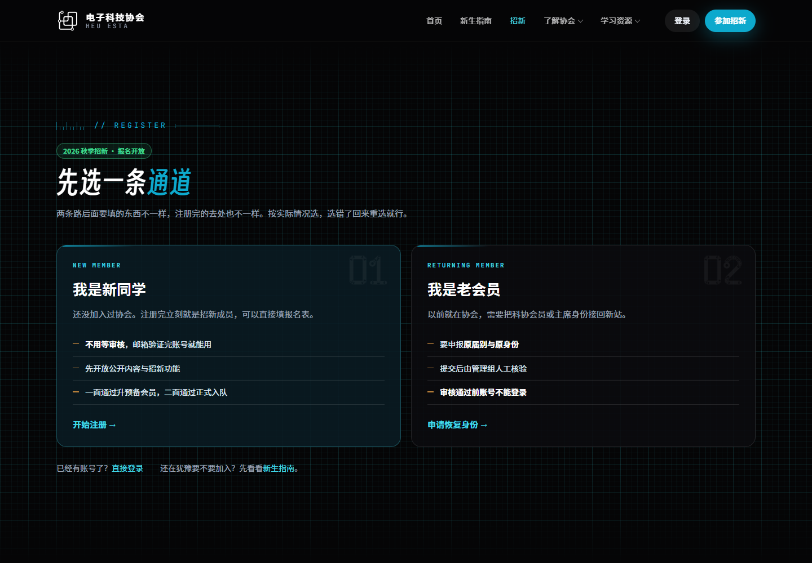

*图 2-1　注册入口会明确区分新会员与老会员。*

### 完成结果

浏览器进入“新会员注册”三步表单，页面左侧显示账号等级变化说明。

### 常见错误

- **新生误选老会员通道**：返回注册入口重新选择；老会员通道提交后账号会等待审核，不能立即登录。
- **页面直接跳回首页**：你可能已经登录。先退出当前账号，再打开注册入口。

## 3. 填写基础身份信息

### 操作目标

填写用于身份核验和招新分组的基础档案。

### 具体步骤

1. 在“姓名”中填写本人真实姓名，不要填写网名。
2. 在“学号”中填写本人完整学号。
3. 从固定列表选择学院；不要用简称代替正式学院名称。
4. 从固定届别中选择实际入学年份，例如 2026 年入学选择“2026 级”。
5. 选择“硬件”“软件”或“自定义”擅长方向。
6. 选择“自定义”时，继续填写具体方向说明，否则表单不会通过校验。
7. 点击“下一步”。

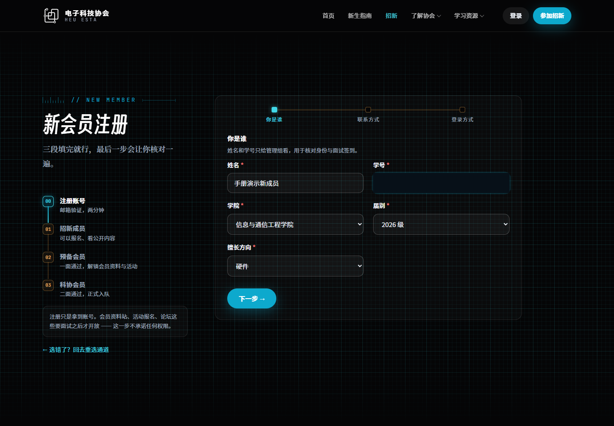

*图 3-1　身份信息使用固定学院、届别和方向选项。*

### 完成结果

进度条进入“联系方式”，第一步输入仍会保留。

### 常见错误

- **提示学号已注册**：不要重复注册，前往登录页点击“忘记密码？用邮箱重置”。
- **学院找不到**：使用下拉列表中的学校正式名称；仍无法确定时在招新群询问。
- **自定义方向报错**：必须同时填写“自定义方向”文本框。

## 4. 填写方向与联系方式

### 操作目标

绑定可用于验证码、面试联络和账号找回的联系方式。

### 具体步骤

1. 填写本人常用邮箱，确保拼写正确。
2. 点击“获取验证码”。按钮会进入 60 秒倒计时，同一验证码有效 10 分钟。
3. 打开邮箱查收“【HEU ESTA】注册验证码”，不要把验证码转发给他人。
4. 将 6 位验证码填回注册页。
5. 填写 11 位中国大陆手机号。
6. 填写 5–15 位数字 QQ 号；没有或暂不填写时可留空。
7. 点击“下一步”。

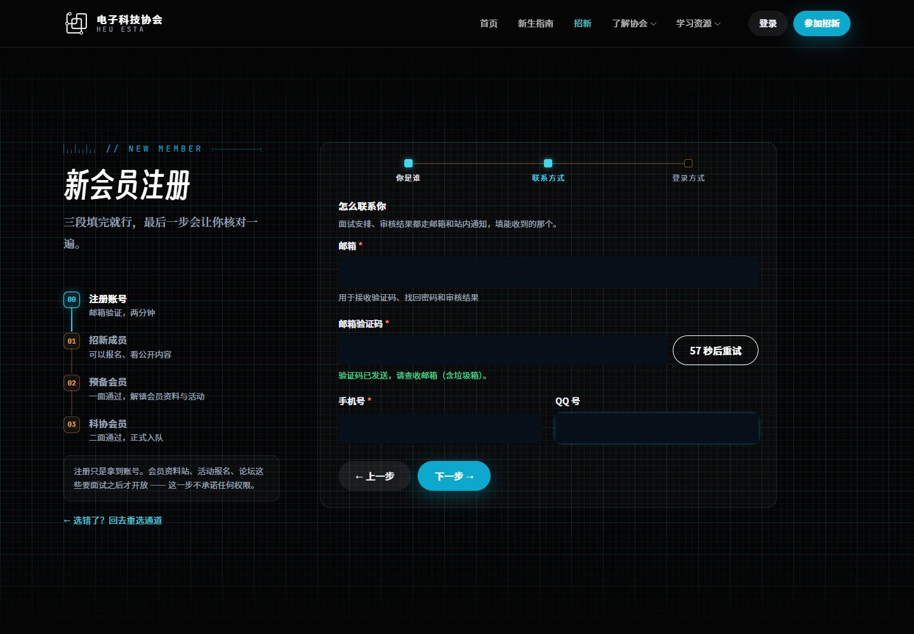

*图 4-1　邮箱、验证码、手机和 QQ 均属于私密档案，截图中已遮挡。*

### 完成结果

页面进入“登录方式”，邮箱验证码仍在有效期内。

### 常见错误

- **验证码收不到**：检查垃圾箱，确认邮箱没有空格；60 秒后再发送一次。
- **提示今日发送次数已达上限**：不要继续尝试，次日再试或联系站务。
- **手机号已被使用**：说明该手机号已绑定其他账号，优先找回原账号。

## 5. 完成邮箱验证与密码设置

### 操作目标

设置登录凭据、确认隐私说明并提交注册。

### 具体步骤

1. 填写用户名。用户名用于登录，创建后不要频繁更换对外称呼来代替它。
2. 输入不少于 8 位的新密码，并在“确认密码”再次输入。
3. 阅读页面中的隐私说明，确认姓名、学号和联系方式只用于身份核验、招新联系与账号安全。
4. 勾选“我已阅读并同意隐私说明”。
5. 再次检查邮箱、学号和手机号后，点击“完成注册”。

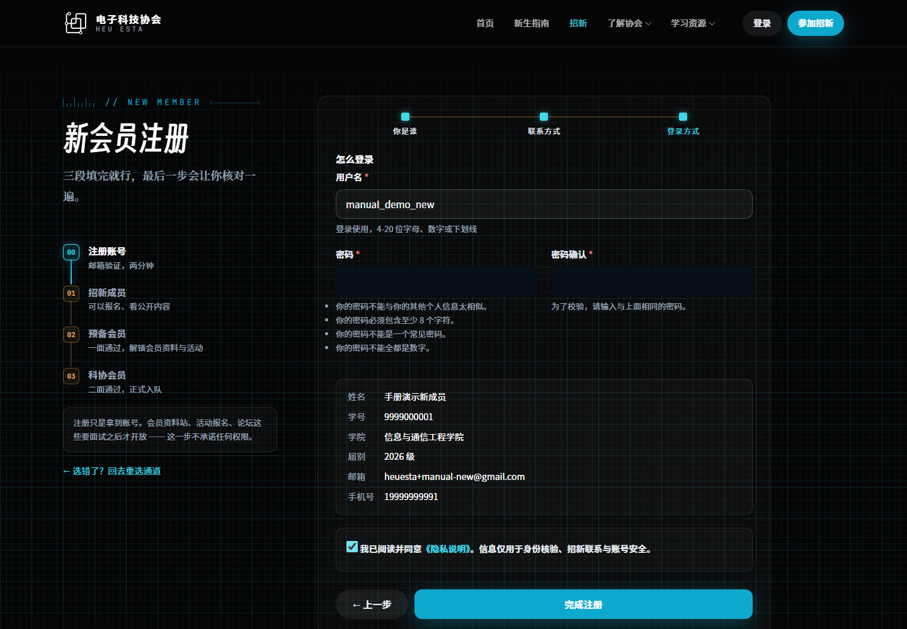

*图 5-1　提交前应检查用户名、密码规则和隐私同意项。*

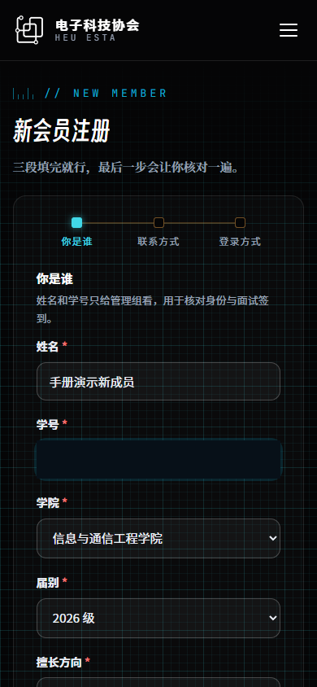

*图 5-2　手机端按同样的三步流程填写，使用顶部进度条确认当前位置。*

### 完成结果

网站创建“招新成员”账号并自动登录。招新开放期间，页面会直接带你进入招新页。

### 常见错误

- **两次密码不一致**：重新输入两次相同密码。
- **密码与个人信息太相似**：改用更长、包含不同类型字符的密码。
- **验证码不正确或过期**：每个验证码最多尝试 5 次；重新获取后使用最新邮件中的验证码。
- **提交后提示邮箱、学号或手机号重复**：可能发生了并发注册，请尝试登录或找回密码，不要连续创建账号。

## 6. 注册成功与自动登录

### 操作目标

确认账号已经建立，并理解“注册成功”和“报名完成”的区别。

### 具体步骤

1. 查看页面顶部的成功提示和右上角账号名称。
2. 确认招新页右侧出现“报名表”，而不是只停留在宣传内容。
3. 阅读招新流程、当前批次名称和面试说明。
4. 继续完成后续五步报名表；此时尚未产生报名记录。

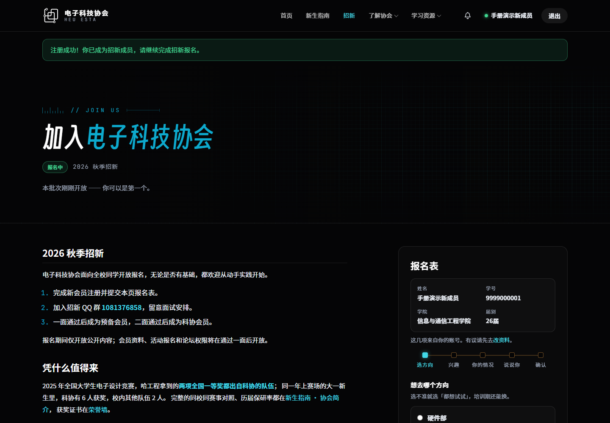

*图 6-1　自动登录后进入招新页，还需要填写右侧报名表。*

### 完成结果

右上角显示“招新成员”，可以开始提交本批次报名。

### 常见错误

- **注册后看不到报名表**：确认当前批次处于报名中，并刷新页面；仍无表单时联系站务。
- **右上角仍显示“登录”**：注册可能未成功，不要重复提交，先尝试用刚设置的用户名登录。

## 7. 加入招新群

### 操作目标

加入面试通知与日常交流使用的官方招新 QQ 群。

### 具体步骤

1. 在招新页找到“面试通知与日常交流”卡片。
2. 使用手机 QQ 扫描二维码，或在 QQ 中搜索群号 **1081376858**。
3. 按群验证要求填写真实姓名、学院等信息。
4. 入群后查看群公告，但面试状态仍以官网和站内通知为准。

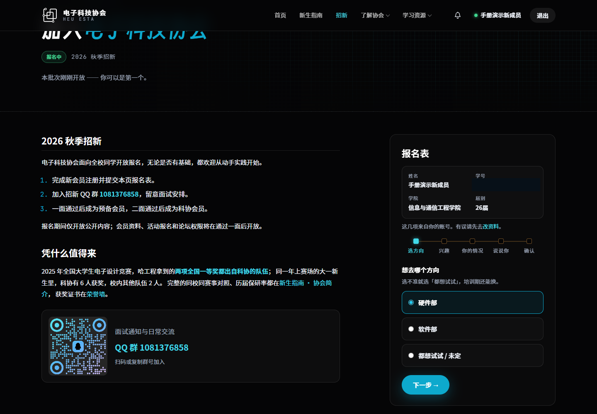

*图 7-1　官网同时提供二维码和完整群号。*

### 完成结果

你已进入官方招新群，并能接收临时安排和答疑信息。

### 常见错误

- **二维码无法识别**：保存页面截图后从 QQ 相册识别，或直接搜索群号。
- **搜索不到群**：核对群号是否为 1081376858，不要加入名称相似的非官方群。
- **长时间未通过入群申请**：在官网反馈页留言，或请已在群内的同学联系管理员。

## 8. 填写报名第一至二步

### 操作目标

选择意向部门和感兴趣的技术方向，帮助协会安排面试与培训。

### 具体步骤

1. 在“选方向”中选择“硬件部”“软件部”或“都想试试 / 未定”。
2. 如果暂时无法判断，选择“都想试试 / 未定”，不要为了通过表单随意选部门。
3. 点击“下一步”进入“兴趣”。
4. 从射频、单片机、嵌入式、模拟电子、DSP/FPGA、电源、模型控制等选项中勾选至少一项。
5. 完全不了解时可勾选“目前还不了解”，这不会成为筛选理由。
6. 勾选“其他”时，在下方填写具体方向。

*图 8-1　部门代表意向分组，可以选择“都想试试 / 未定”。*

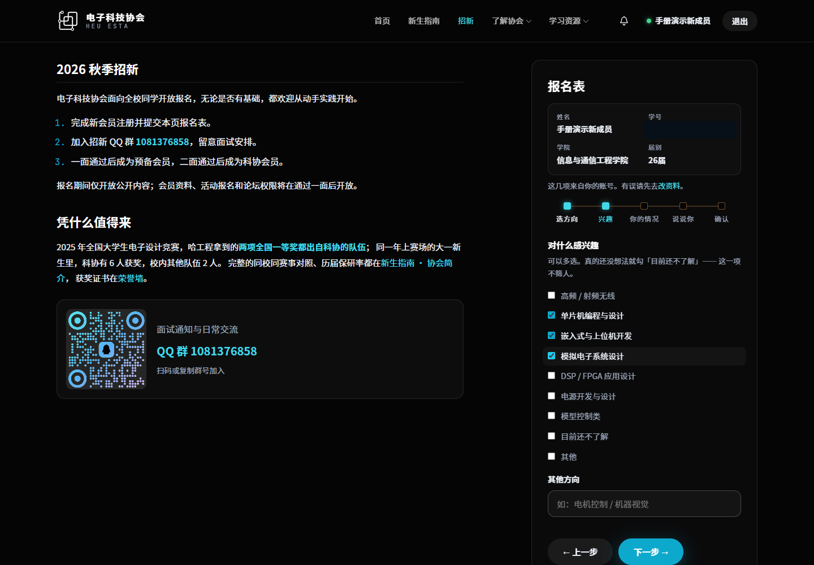

*图 8-2　兴趣方向可多选，主要用于培训与面试准备。*

### 完成结果

报名进度条完成“选方向”和“兴趣”两个节点。

### 常见错误

- **兴趣页无法下一步**：至少选择一项；勾选“其他”后必须填写补充说明。
- **不知道硬件和软件怎么选**：选择“未定”，在自我介绍中说明想进一步了解。

## 9. 填写报名第三至五步

### 操作目标

补充个人情况、自我介绍和了解渠道，让面试人员更准确地认识你。

### 具体步骤

1. 在“你的情况”中选择性别；不希望公开或填写时选择“不愿透露”。
2. 生日用于站内祝福与分组，不会自动公开；可按实际情况填写或留空。
3. 在“主要经历 / 兴趣爱好”中如实说明做过什么。零基础可以直接写“零基础但很想学”。
4. 在“说说你”中填写不少于 10 个字的自我介绍，说明为什么想加入及希望获得什么。
5. “对协会的初步印象”和“对大学四年的寄语”可以留空，但认真填写有助于面试沟通。
6. 在最后一步选择一个或多个了解渠道；选择“其他”时填写具体来源。
7. 使用“上一步”返回检查，不要依赖浏览器后退键。

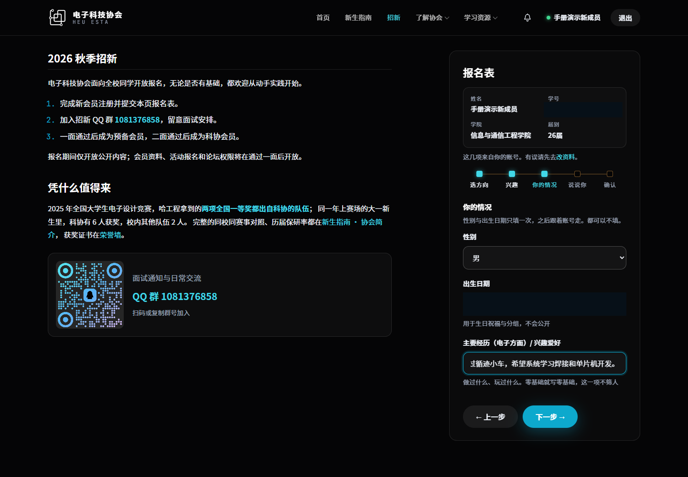

*图 9-1　性别和生日属于账号档案，不会自动出现在公开成员展示中。*

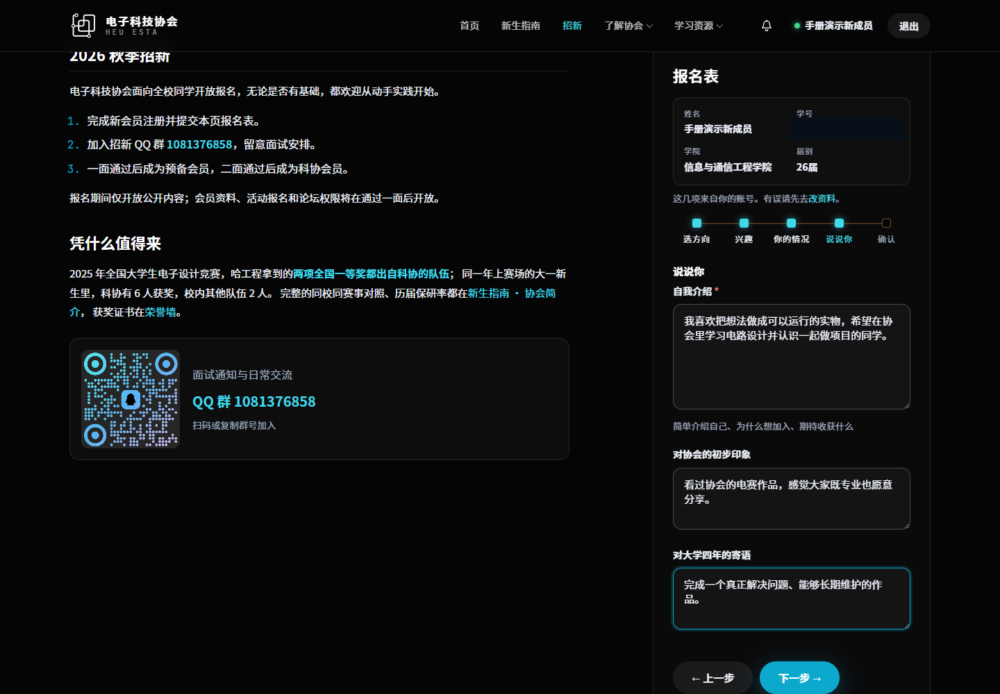

*图 9-2　自我介绍应真实、具体，不要求已有技术基础。*

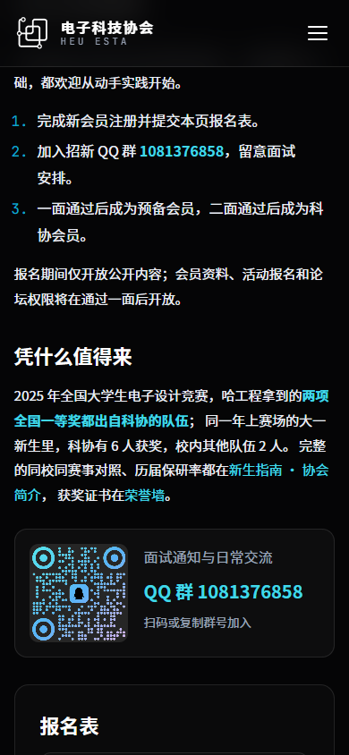

*图 9-3　手机端表单位于介绍内容下方，可正常逐步填写。*

### 完成结果

五步进度条到达“确认”，所有必填项已经完成。

### 常见错误

- **自我介绍太短**：至少写 10 个字，建议包含动机、兴趣和期待。
- **勾选“其他”后报错**：检查对应补充文本框是否为空。
- **页面刷新后内容丢失**：报名表在最终提交前不是云端草稿，长文可先在本地备忘录中编辑。

## 10. 确认并提交报名

### 操作目标

在不可自行修改前完成最后检查，并建立唯一报名记录。

### 具体步骤

1. 在确认页依次核对方向、兴趣、经历、自我介绍和了解渠道。
2. 如有错误，点击“上一步”返回对应节点修改。
3. 确认无误后点击“提交报名”。
4. 等待页面显示“已报名”状态，不要连续点击或重复刷新提交。
5. 提交后如需改正信息，在招新 QQ 群联系站务；本人暂不能直接编辑已提交答卷。

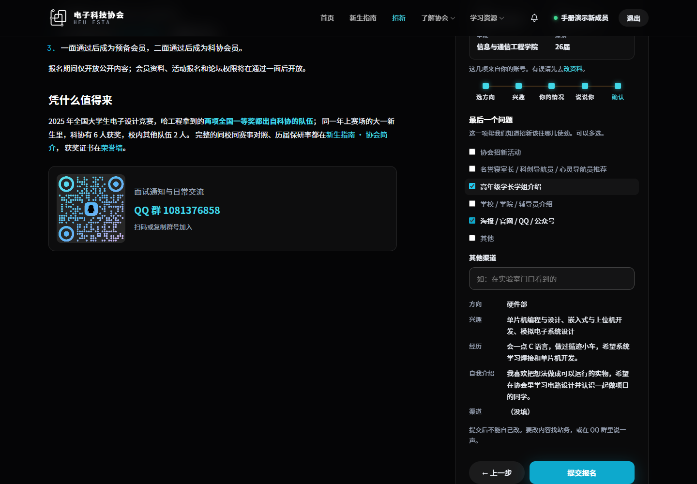

*图 10-1　确认页汇总全部答案，提交后同一账号不能重复报名。*

### 完成结果

系统为当前账号和当前批次建立一条报名记录，状态为“已报名”。

### 常见错误

- **点击后没有变化**：等待数秒后检查状态区；不要重复创建账号。
- **提示已经报名**：这是重复提交保护，回到招新首页查看现有进度。
- **内容写错**：在群内说明账号用户名和需要更正的字段，不要公开发送密码或验证码。

## 11. 查看报名进度

### 操作目标

在官网确认材料是否提交成功，以及面试状态对应的会员等级变化。

### 具体步骤

1. 登录后打开 <https://heuesta.cn/recruitment/>。
2. 在右侧“你的报名”查看当前状态和意向部门。
3. 状态为“已报名”时等待面试安排。
4. “一面通过”后账号升级为预备会员，可按权限访问会员内容和论坛。
5. “二面通过”后账号升级为科协会员。
6. “未录取”是本次流程终止状态；如对结果有疑问，按招新公告中的方式咨询。

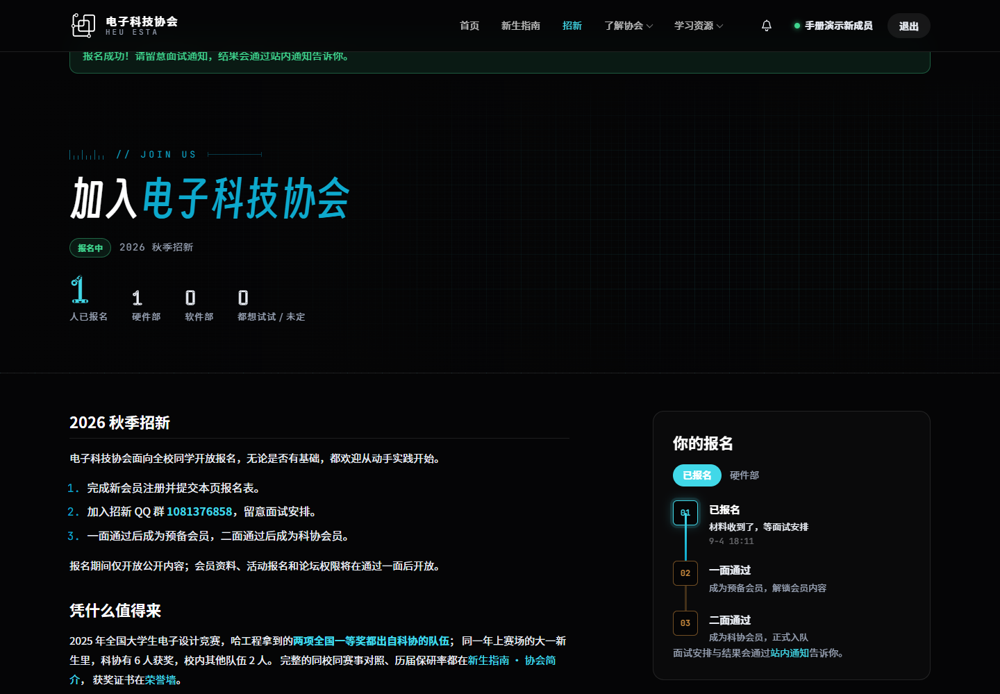

*图 11-1　提交成功后出现状态时间线。*

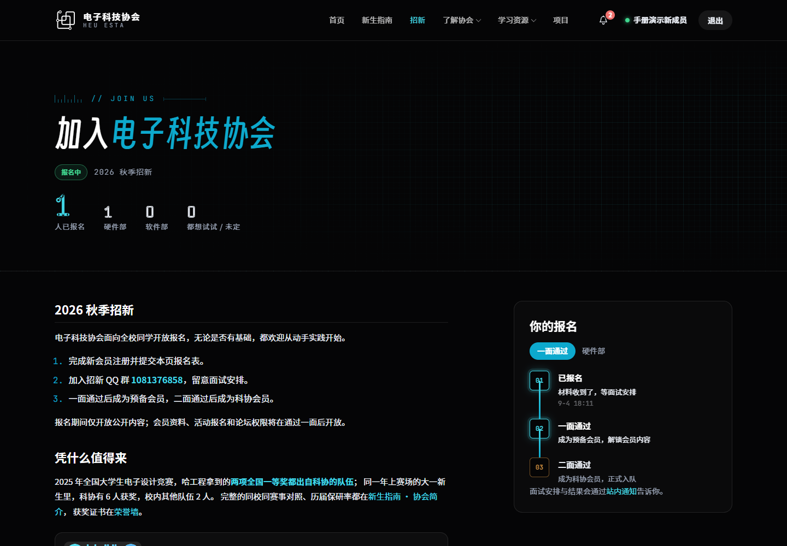

*图 11-2　一面通过后成为预备会员。*

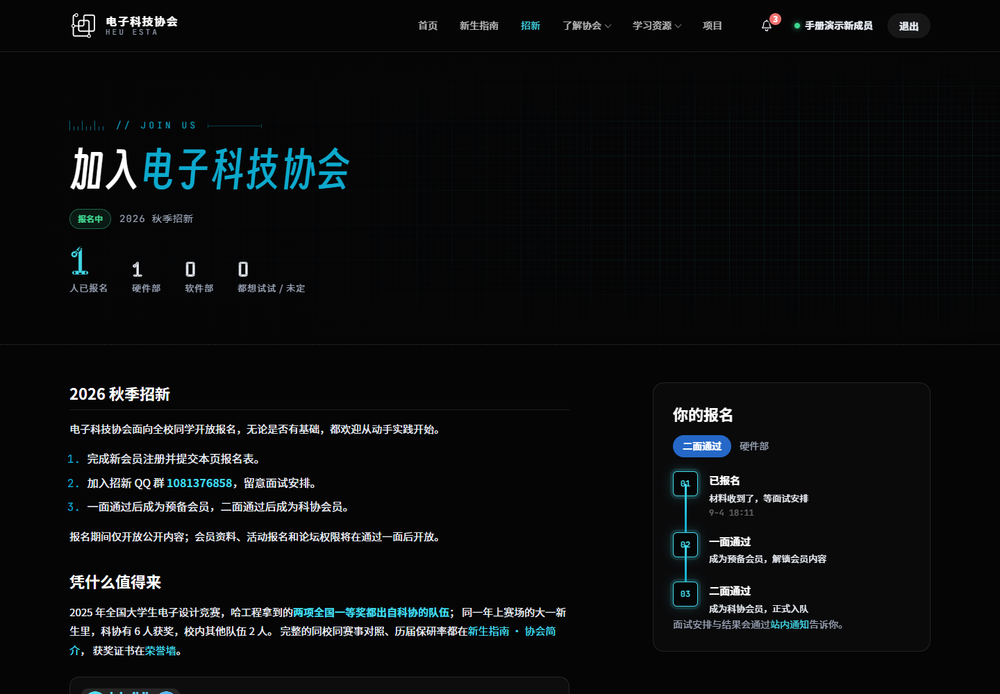

*图 11-3　二面通过后成为科协会员。*

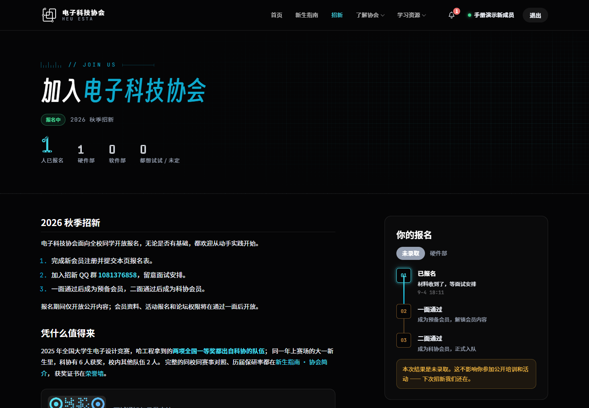

*图 11-4　未录取会单独显示，不作为时间线的“第四个成就”。*

### 完成结果

你能根据状态时间线判断当前进度和已获得的账号权限。

### 常见错误

- **群里通知已通过但官网未更新**：稍等后刷新；仍不一致时将账号用户名发给站务核对。
- **状态变化后论坛仍不能登录**：退出官网重新登录，再从官网进入论坛；一面未通过前属于正常限制。

## 12. 接收面试通知

### 操作目标

通过官网、邮箱和 QQ 群及时获得面试安排与结果。

### 具体步骤

1. 登录后点击右上角铃铛，查看站内通知。
2. 定期检查注册邮箱及垃圾邮件箱。
3. 关注招新 QQ 群公告和官网公告。
4. 对时间、地点存在冲突时尽早按公告给出的方式联系负责人。
5. 任何人索要密码或验证码都应拒绝；站务核验只需要用户名等非密码信息。

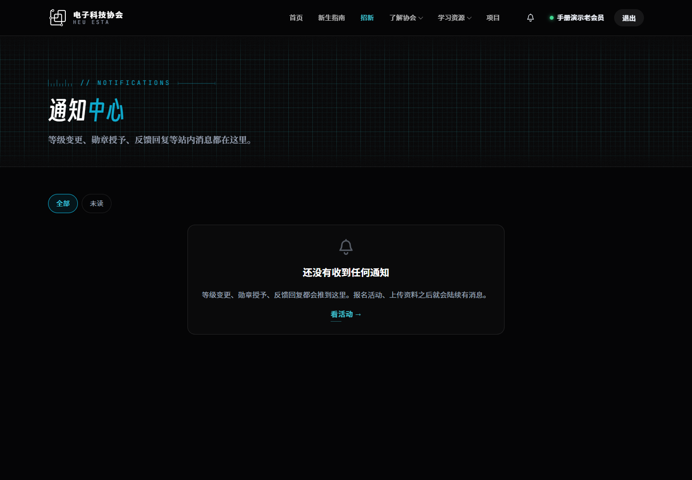

*图 12-1　通知中心集中显示等级变化、勋章、反馈和活动消息。*

### 完成结果

你已建立至少两条可靠通知渠道，并知道以官网最新安排为准。

### 常见错误

- **通知中心为空**：还没有产生站内消息并不代表报名失败，请以招新状态页为准。
- **邮件被拦截**：将官网发件地址加入白名单，并检查垃圾箱。

## 13. 注册后的账号管理

### 操作目标

安全登录、修改资料，并在忘记密码时自行恢复账号。

### 具体步骤

1. 打开 <https://heuesta.cn/accounts/login/>，使用用户名和密码登录。
2. 也可切换到“验证码登录”，使用注册邮箱获取一次性验证码。
3. 忘记密码时点击“忘记密码？用邮箱重置”，填写注册邮箱、验证码和新密码。
4. 登录后从右上角进入个人中心，检查学院、届别、方向等档案。
5. 需要退出时使用右上角“退出”，不要只关闭公共电脑的浏览器标签页。

*图 13-1　密码登录使用用户名，不是姓名或学号。*

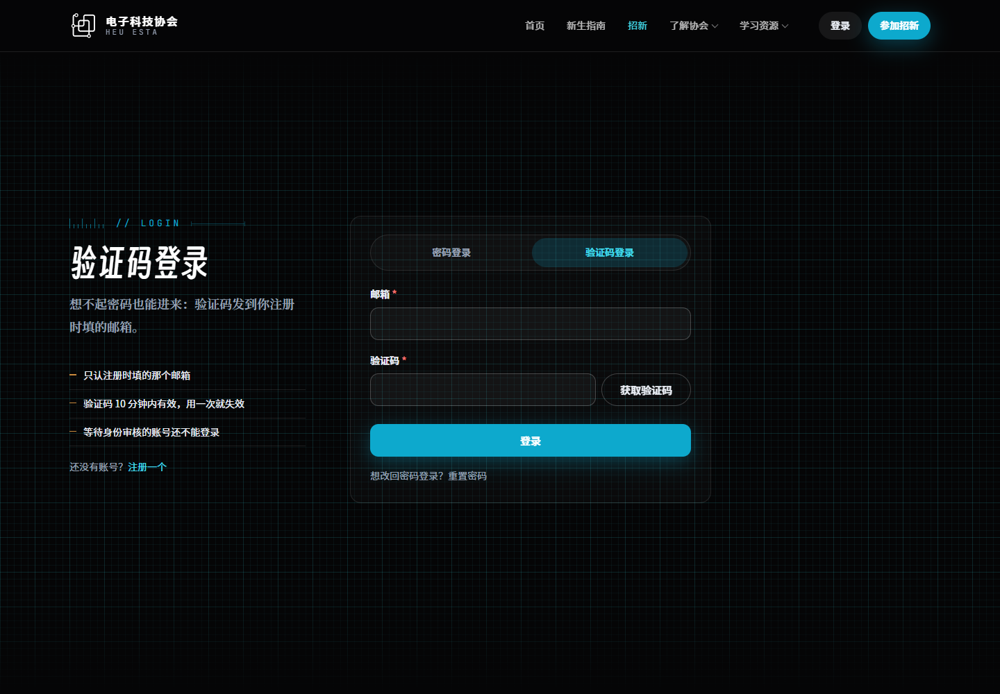

*图 13-2　验证码登录使用注册邮箱。*

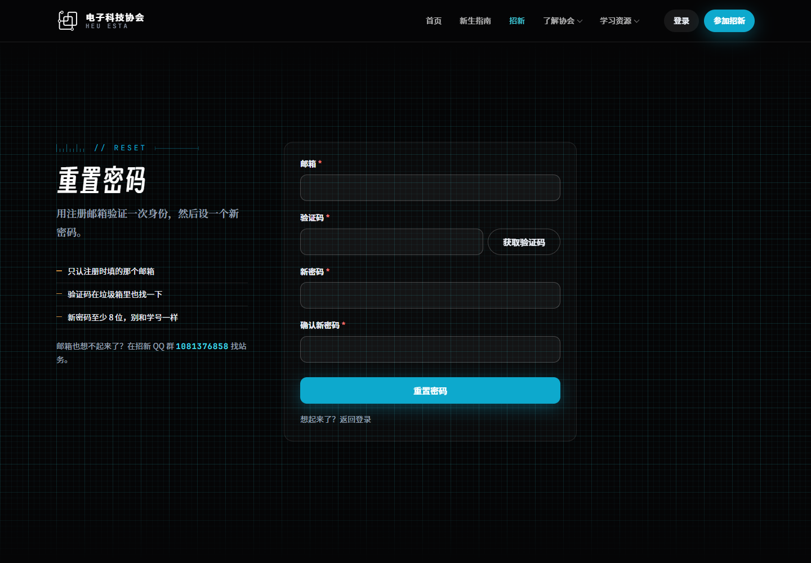

*图 13-3　找回密码会验证注册邮箱并要求设置新密码。*

### 完成结果

你能够独立登录、退出和重置密码，不需要创建重复账号。

### 常见错误

- **邮箱未注册**：确认输入的是注册时使用的邮箱；不确定时联系站务核验账号。
- **用户名忘记**：不要用姓名反复尝试，可提供姓名和学号请站务协助查询。
- **在公共电脑登录**：操作完必须点击“退出”，并避免让浏览器保存密码。

## 14. 权限与常见问题

### 操作目标

理解招新成员权限边界，并快速判断问题应自行处理还是联系站务。

### 具体步骤

1. 先确认右上角显示的等级：新注册应为“招新成员”。
2. 招新成员可查看公开公告、维护本人资料和报名，不可进入会员资料、活动报名、项目内部功能或论坛账号体系。
3. 一面通过后成为预备会员，会员内容和论坛 SSO 才会开放。
4. 遇到 403 通常是权限不足；遇到 404 先核对网址，避免使用旧收藏链接。
5. 页面提交失败时记录网址、操作步骤和错误提示，联系站务时不要发送密码、验证码或完整身份证明截图。

### 完成结果

你能区分正常权限限制与网站故障，并提供足够的信息帮助站务定位问题。

### 常见问题速查

| 现象 | 处理方法 |
|---|---|
| 验证码 60 秒内不能重发 | 等待倒计时结束；使用最新验证码 |
| 验证码连续错误 | 最多 5 次后作废，重新获取 |
| 学号、邮箱或手机号已存在 | 使用原账号登录或找回密码 |
| 报名提交后不能修改 | 在 QQ 群联系站务更正 |
| 论坛无法登录 | 一面通过前属于正常权限限制 |
| 手机页面拥挤 | 竖屏使用并刷新；不要开启强制桌面模式 |
| 状态与通知不一致 | 以招新页状态为主，并联系站务复核 |

## 获取帮助

- 招新 QQ 群：**1081376858**
- 官网反馈：<https://heuesta.cn/feedback/>
- 官网：<https://heuesta.cn/>

向站务报告问题时，请提供发生时间、页面网址、账号用户名、操作步骤和完整错误文字。请勿发送密码、邮箱验证码、Cookie 或其他登录凭据。
