# HEU ESTA 网站管理手册

**内部使用｜请勿公开传播**

哈尔滨工程大学电子科技协会（HEU ESTA）

本手册覆盖日常内容与会员管理，不记录管理员密码、服务器地址、证书、密钥或第三方服务凭据。部署、备份、CDN、域名和服务器故障统一参阅仓库中的《维护手册》。截图来自 2026 年 9 月 4 日正式站，敏感会员信息与邮件内容已遮挡。

> 正式站：<https://heuesta.cn/>
> 管理驾驶舱：<https://heuesta.cn/dashboard/>
> 网站版本：`9c9b9e8`

## 操作安全原则

1. 只处理职责范围内的数据，不共享管理员账号。
2. 批量晋级、扣分、删除、下架和站点配置变更前，先确认筛选范围与影响对象。
3. 演示或培训只使用带“手册演示”标识的测试数据，不修改真实会员、正式公告和关键配置。
4. 不在截图、工单、聊天或仓库中粘贴密码、验证码、Cookie、OAuth 令牌、邮箱应用专用密码或服务器密钥。
5. 遇到异常先保留证据和停止重复操作；不要用“多点几次”验证不可逆按钮。

## 1. 手册说明与权限边界

### 操作目标

明确站务管理、系统管理员、职位授权和论坛管理员的职责边界。

### 具体步骤

1. 在个人中心查看账号等级和是否出现“管理驾驶舱”。
2. **站务管理**可处理日常会员、招新、内容、活动、项目、荣誉和反馈。
3. **系统管理员**拥有更高权限，可调整其他账号的站务/系统等级，并进入 Django 高级后台。
4. 主席、硬件主席、软件主席可按职位配置获得管理驾驶舱权限；副主席和普通科协会员默认不自动获得。
5. 自建职位不自动授予站务权限。需要管理权限时应单独调整账号等级，并留下原因。
6. 主站管理员身份不等于 NodeBB 论坛管理员；论坛 ACP 和邮箱插件配置由持有论坛管理员权限的账号操作。

### 完成结果

操作者知道自己能做什么、不能做什么，以及何时应升级给系统管理员或运维负责人。

### 常见错误

- **担任职位却进不了驾驶舱**：职位与权限解耦，检查该职位是否配置管理权限或账号等级是否为站务管理。
- **主站超管打不开论坛 ACP**：两套权限独立，需要论坛管理员授权。
- **把成员公开展示当作权限**：展示只影响公开页面，不授予任何后台能力。

## 2. 登录与后台导航

### 操作目标

安全登录管理账号，进入驾驶舱并识别各模块入口。

### 具体步骤

1. 打开 <https://heuesta.cn/accounts/login/>，使用管理员用户名和密码登录。
2. 也可使用注册邮箱验证码登录，但必须确认管理员邮箱真实可收信。
3. 点击顶部“管理”，或在个人中心点击“管理驾驶舱”。
4. 左侧依次为数据总览、会员、展示、公告、活动、招新、资料、荣誉、项目、素材、反馈、勋章、职位和站点设置。
5. 左下角“高级后台（Admin）”仅供系统管理员在必要时使用。
6. 操作结束后点击“退出”，公共设备上同时关闭浏览器并清除会话。

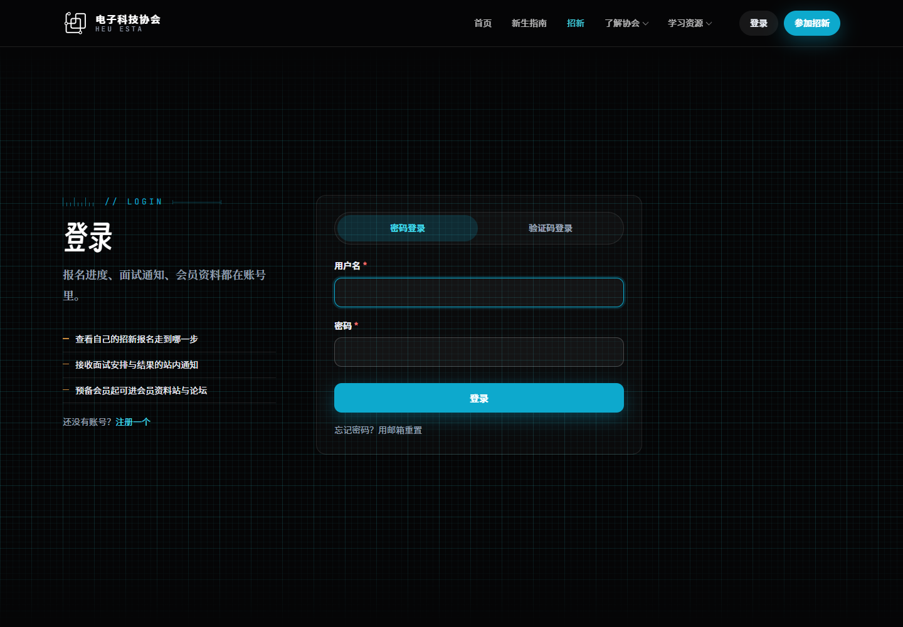

*图 2-1　登录界面与普通会员共用，权限由账号决定。*

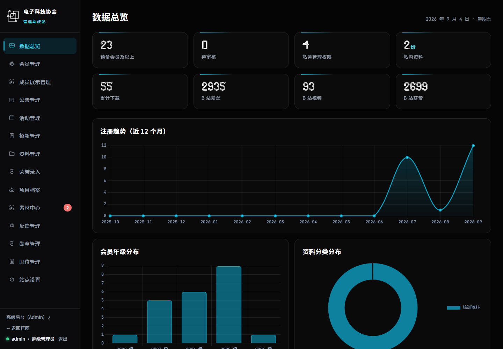

*图 2-2　驾驶舱左侧为固定模块导航，底部显示当前管理身份。*

### 完成结果

成功进入驾驶舱，并能在不使用旧书签的情况下找到目标模块。

### 常见错误

- **登录后没有“管理”按钮**：账号未获站务权限，联系系统管理员核验。
- **验证码发送失败**：确认管理员账号绑定的邮箱存在且可收信；不要把不可达邮箱当作备用登录方式。
- **直接访问后台 403**：先重新登录；仍无权限时停止尝试，不要更改 URL 绕过。

## 3. 数据总览

### 操作目标

快速识别待处理事项和近期趋势，不把统计指标误当作业务结论。

### 具体步骤

1. 打开“数据总览”。
2. 查看预备会员及以上、待审核、站务权限、站内资料等核心计数。
3. 查看近 12 个月注册趋势和会员年级分布，关注突然异常增长或归零。
4. 查看资料分类、下载 Top 10 和外部平台统计；外部指标可能存在同步延迟。
5. 发现异常后进入对应模块核对原始记录，不直接根据图表修改数据。

*图 3-1　统计卡片用于发现问题，实际处理应回到具体记录。*

### 完成结果

掌握当前待办和数据变化，并知道下一步应进入哪个模块。

### 常见错误

- **计数与列表差一两条**：检查筛选条件、账号是否停用及统计口径。
- **外部平台数据不更新**：先确认同步任务和第三方接口状态，不要手工伪造统计值。

## 4. 会员管理

### 操作目标

按姓名、用户名、学号等定位成员，安全调整等级、权限和积分。

### 具体步骤

1. 进入“会员管理”，切换“老会员审核”“招新成员”或“全部成员”。
2. 在搜索框输入姓名、用户名或学号；结合届别和等级筛选。
3. 打开或勾选目标成员，核对姓名、学院、届别、方向和当前等级。
4. 批量晋级前再次确认勾选数量，只对明确对象使用“晋升预备会员”或“晋升科协会员”。
5. “设为站务管理”和“设为系统管理员”仅系统管理员可用；必须有明确授权理由。
6. 调整积分时填写正负分值和说明，确认后点击“发放 / 扣除”。
7. 完成后重新搜索目标成员，核对等级与积分结果。

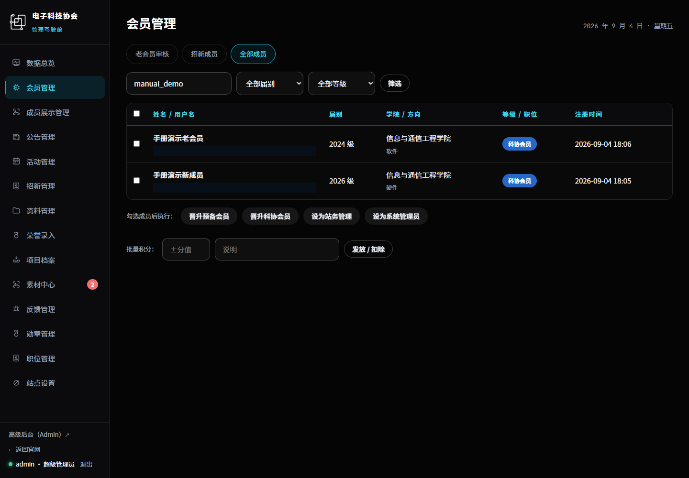

*图 4-1　演示列表只包含两个临时账号，身份字段已遮挡。*

### 完成结果

目标成员的等级或积分按预期变化，其他成员未受影响。

### 常见错误

- **搜索不到成员**：切到“全部成员”，清除届别/等级筛选后再查。
- **误选多名成员**：在提交前查看勾选框；误操作后立即记录对象和时间，按日志反向修正。
- **用职位代替等级**：职位任命在“职位管理”处理，会员等级在本页处理，两者不要混用。

## 5. 老会员审核

### 操作目标

核验老会员申报，修正目标身份并批准、拒绝或重新审核。

### 具体步骤

1. 在“会员管理”选择“老会员审核”。
2. 按用户名、姓名或届别筛选待审核记录。
3. 核对姓名、学号、学院、届别、原身份、方向和提交时间。
4. 在“审核”下拉框选择批准后的会员等级或固定职位。
5. 填写审核备注，记录核验依据或待补材料。
6. 点击“通过并激活”后，账号立即可以登录，并向注册邮箱发送结果。
7. 资料不足时点击“拒绝”；账号保持停用，记录保留，可补充材料后重新审核。
8. 批准后到“全部成员”重新搜索，确认等级与职位记录正确。

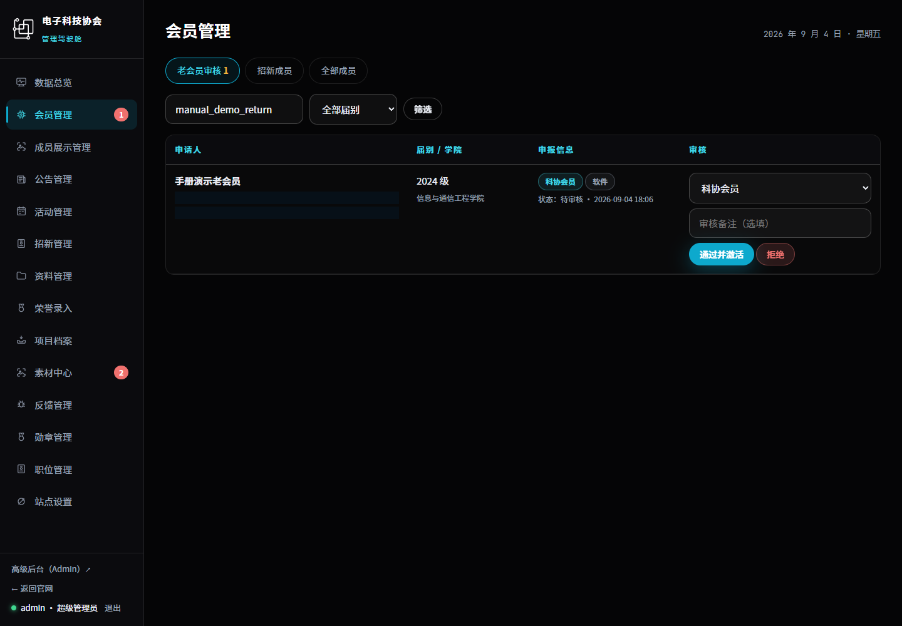

*图 5-1　审核时可修正申报身份，敏感字段已遮挡。*

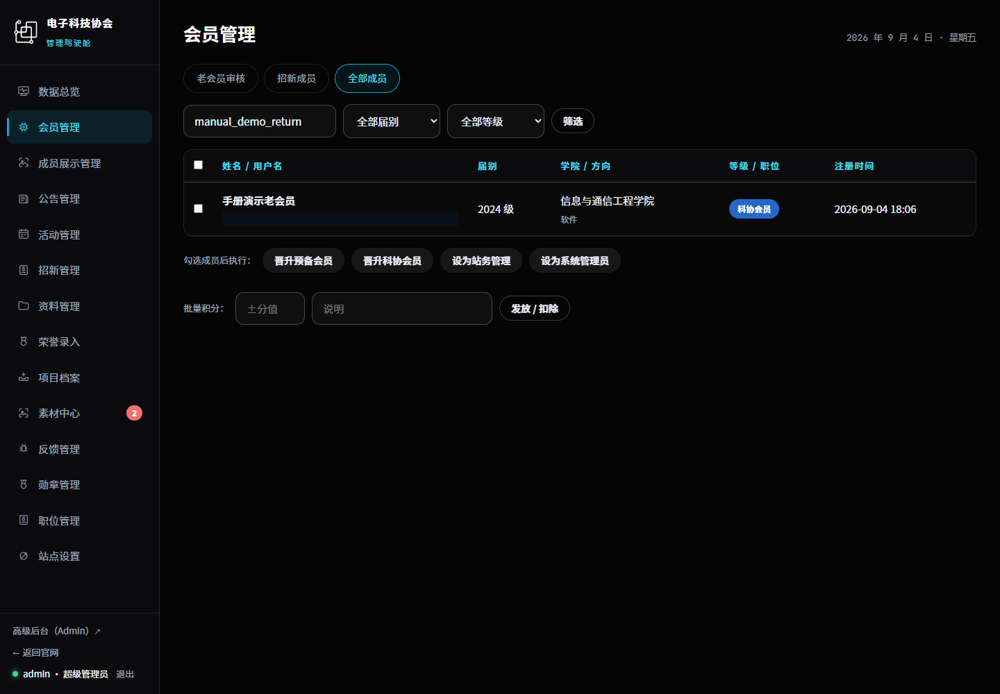

*图 5-2　批准后记录从待审核列表移出，账号被激活。*

### 完成结果

老会员账号得到正确等级和职位，审核备注可供后续追溯。

### 常见错误

- **批准后用户仍不能登录**：确认账号已激活，建议用户退出旧会话后重试。
- **审核邮件未发送**：检查该邮箱可达性和邮件服务日志；不要重复点击批准。
- **职位选错**：到职位管理核对任期和任命类型，必要时卸任并正确补录。

## 6. 招新管理

### 操作目标

维护招新批次、查看答卷、记录面试结果并导出名单。

### 具体步骤

1. 进入“招新管理”，确认当前批次名称、开放时间、截止时间和启用状态。
2. 同一时间通常只启用一个对外批次；截止时间留空表示长期开放。
3. 使用状态、方向和关键词筛选报名者，导出 CSV 前确认筛选范围。
4. 打开报名详情，核对账号档案和完整答卷。
5. 在“面试备注”记录内部信息，不写不必要的敏感评价。
6. 点击“一面通过”会将成员晋升为预备会员；“二面通过”会晋升为科协会员。
7. “本次未录取”是终止状态；“重置为已报名”用于纠正误操作或重新进入流程。
8. 处理后以报名详情和用户招新页双向核对状态。

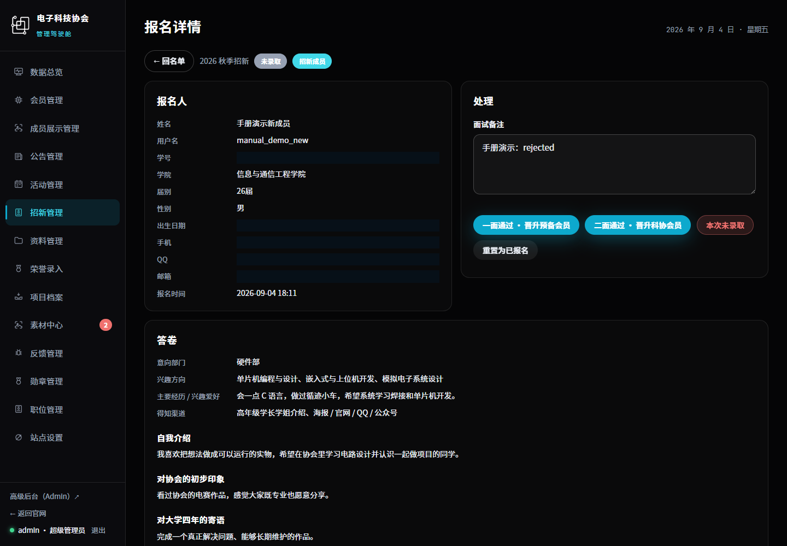

*图 6-1　详情页将账号档案、答卷和处理按钮分区呈现。*

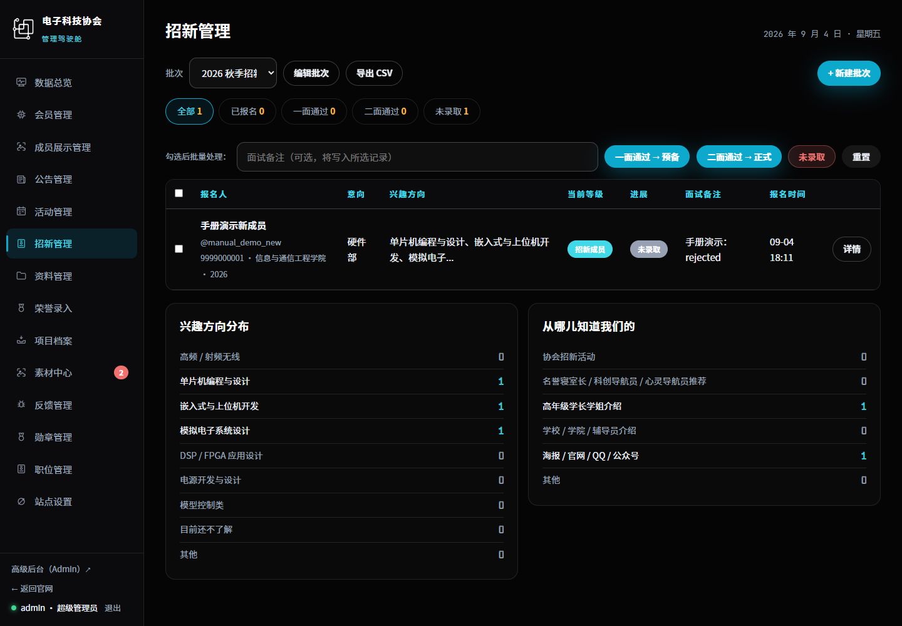

*图 6-2　演示记录处于已报名状态。*

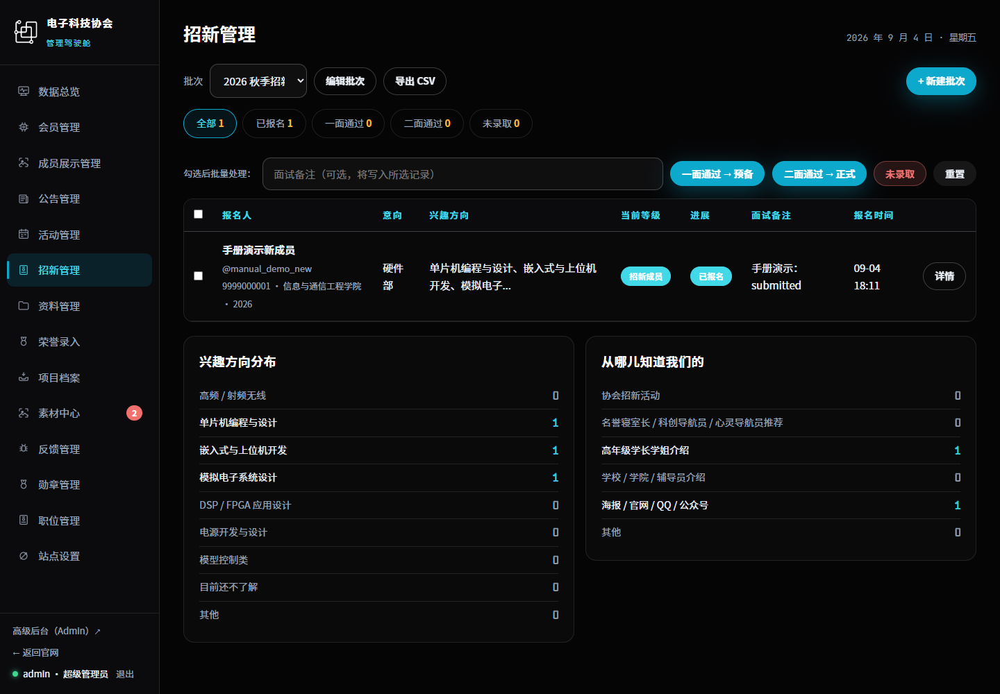

*图 6-3　一面通过同步晋升为预备会员。*

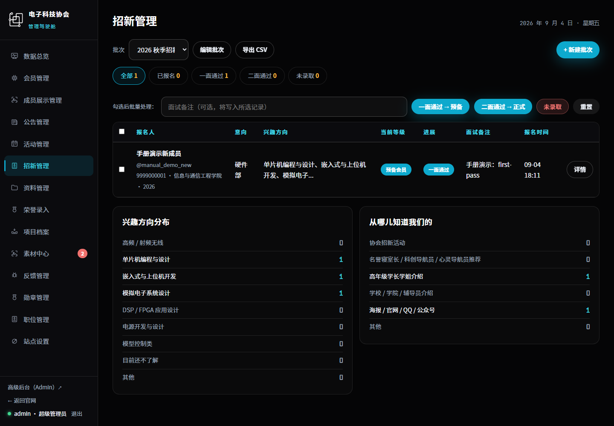

*图 6-4　二面通过同步晋升为科协会员。*

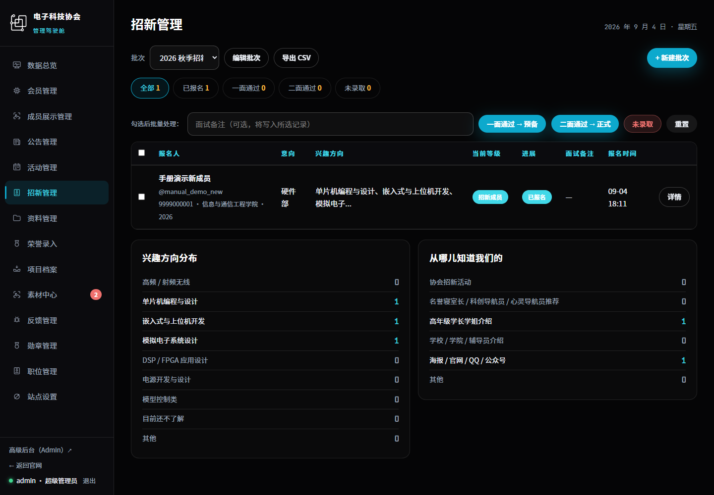

*图 6-5　未录取可使用“重置”恢复为已报名。*

### 完成结果

报名状态、会员等级和用户侧进度一致，导出名单与当前筛选相符。

### 常见错误

- **直接二面通过**：系统会晋升为科协会员，提交前确认面试流程已完成。
- **误点未录取**：保留操作时间和备注，使用“重置”后按正确结果重做。
- **CSV 包含多余人员**：导出前清空或固定筛选条件，并检查文件行数。

## 7. 公告管理

### 操作目标

创建、编辑、发布、置顶或撤回公告，并正确设置可见等级。

### 具体步骤

1. 进入“公告管理”，使用栏目与关键词筛选现有公告。
2. 点击“写公告”，填写标题、栏目、正文和可见范围。
3. 公开招新信息使用公开等级；会员内部信息至少设置为预备会员及以上。
4. 预览 Markdown 排版，检查链接、日期和附件是否有效。
5. 点击发布后，从普通游客或目标等级账号验证可见性。
6. 列表中可置顶、取消置顶、下架、重新发布或删除。
7. 优先使用“下架”保留记录；删除仅用于确认无保留价值的误建内容。

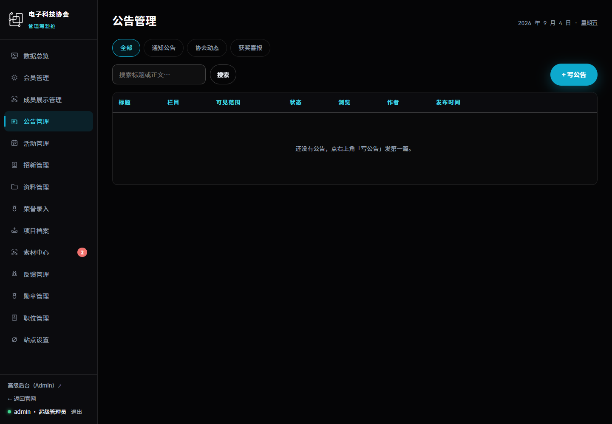

*图 7-1　列表支持栏目、搜索、发布状态和置顶操作。*

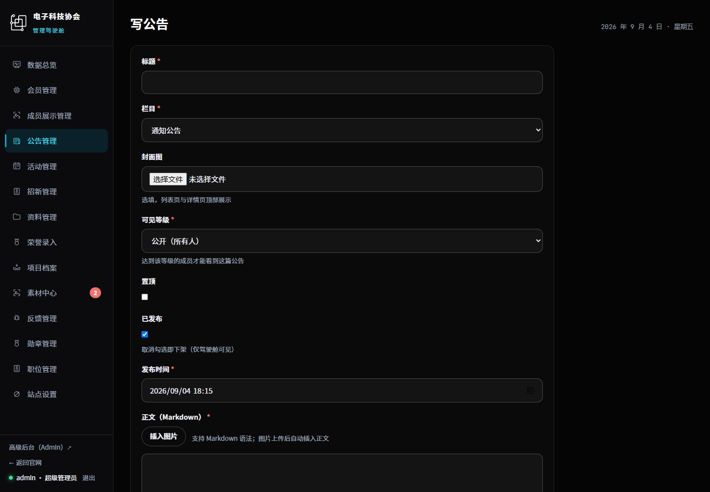

*图 7-2　发布前应同时检查正文和可见范围。*

### 完成结果

公告仅对目标人群可见，标题、正文和发布状态正确。

### 常见错误

- **内部公告被游客看到**：立即下架并修正可见等级，检查是否被外部缓存。
- **修改后页面仍旧**：确认保存成功并刷新；必要时按维护手册清理相关缓存。
- **误删除**：停止进一步操作，记录时间并联系运维从备份评估恢复。

## 8. 活动管理

### 操作目标

创建活动，管理报名、签到和导出名单。

### 具体步骤

1. 进入“活动管理”，点击新建活动。
2. 填写标题、说明、开始/结束时间、地点、人数上限和可见范围。
3. 保存后在列表中发布；未发布活动不应作为正式通知链接传播。
4. 打开报名名单，核对报名人数并按需要导出。
5. 到场时开启签到；结束后及时关闭，避免离场后补签。
6. 管理员代签到前核对姓名和账号，保留现场依据。
7. 活动结束后检查报名、签到和个人中心显示是否一致。

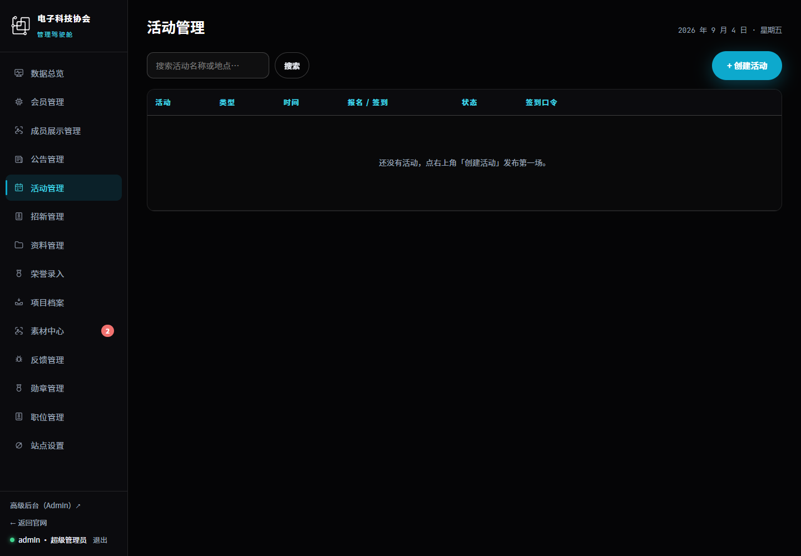

*图 8-1　活动列表集中处理发布、签到和删除。*

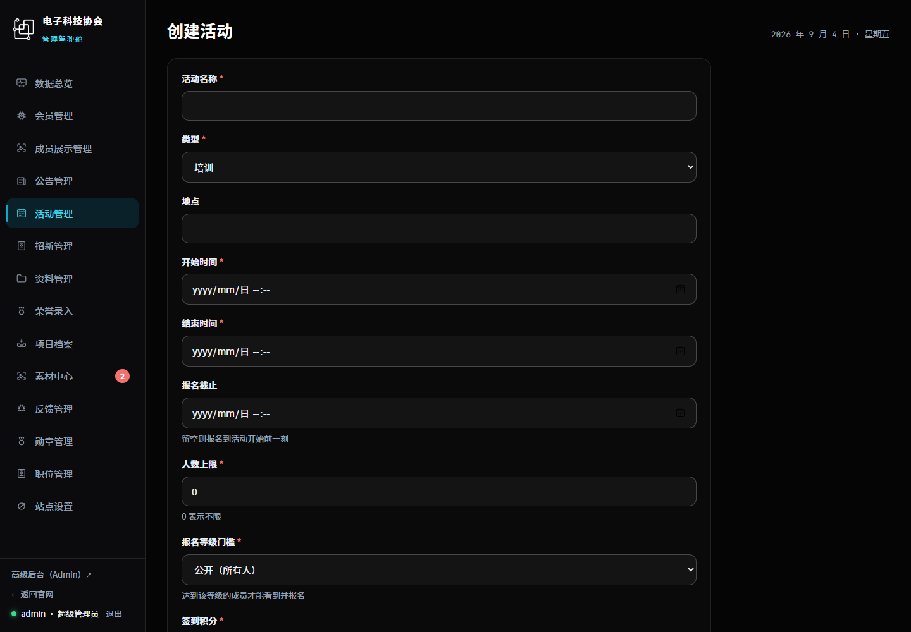

*图 8-2　时间、人数和可见等级是发布前的必查项。*

### 完成结果

活动信息对正确等级开放，报名与签到记录可追溯。

### 常见错误

- **开始时间晚于结束时间**：修正时间后再保存。
- **人数上限临时变化**：修改后通知已报名成员，避免仅在后台静默调整。
- **签到一直开启**：活动结束即关闭，并抽查异常签到记录。

## 9. 资料与项目管理

### 操作目标

上传分级资料，维护项目档案、项目成员和公开作品。

### 具体步骤

1. 在“资料管理”填写标题、分类、说明、可见等级并选择文件。
2. 上传后使用目标等级测试下载；内部资料禁止设置为公开。
3. 删除资料前确认没有公告、教程或项目引用该下载地址。
4. 进入“项目档案”新建项目，填写名称、摘要、状态、封面和公开说明。
5. 添加项目成员时确认账号和职责；浏览公开项目不会自动成为项目成员。
6. 维护阶段与进度，归档结束项目而不是直接删除。
7. 公开作品可被成员展示引用；项目转为私密后，个人展示中的关联作品会隐藏。

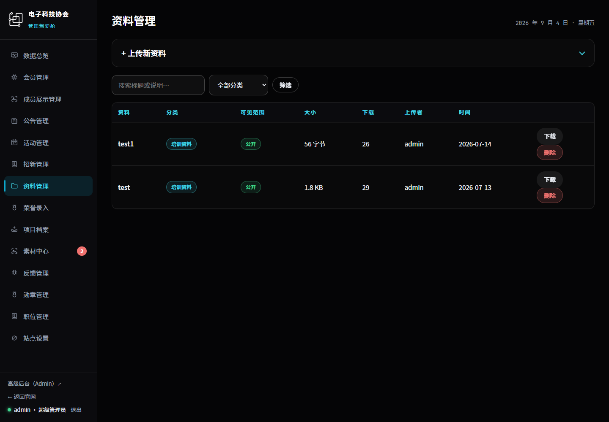

*图 9-1　上传资料时必须明确分类和可见等级。*

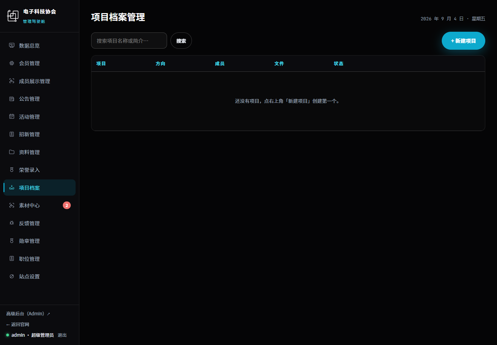

*图 9-2　项目可归档、恢复或删除。*

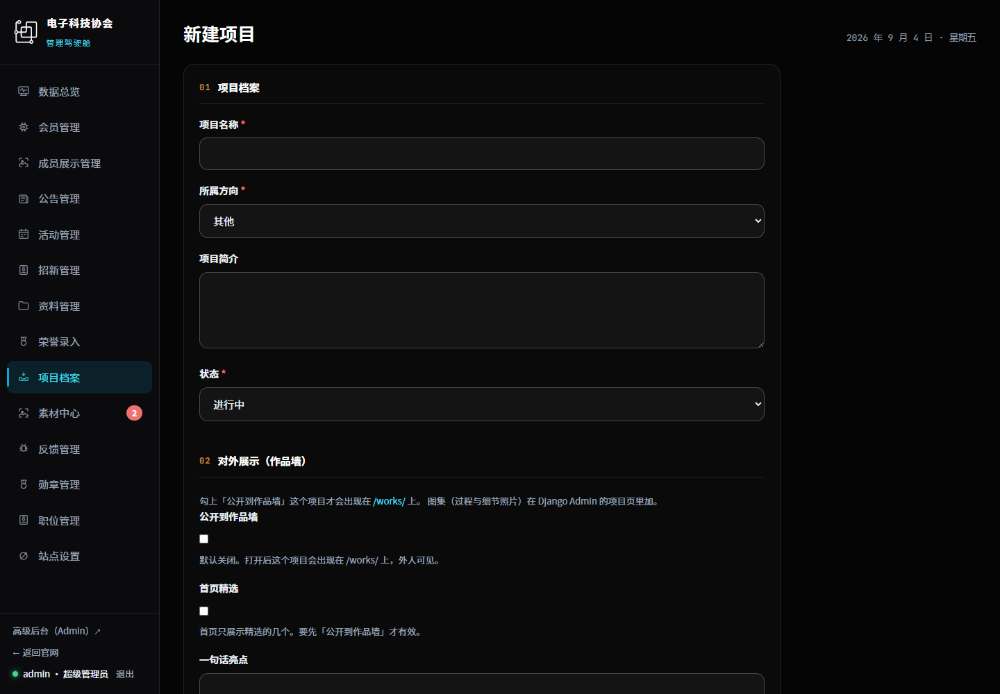

*图 9-3　项目档案同时维护公开信息和成员关系。*

### 完成结果

资料权限正确，项目档案持续可维护，公开作品不会泄露内部内容。

### 常见错误

- **文件上传成功但会员下载失败**：检查可见等级和文件存储状态。
- **项目封面显示异常**：检查图片格式、焦点和缓存，不要上传带敏感 EXIF 的原图。
- **删除项目导致展示缺失**：优先归档；删除前检查成员展示引用。

## 10. 荣誉与素材管理

### 操作目标

维护荣誉记录和官网图片/视频槽位，保证来源、比例与焦点正确。

### 具体步骤

1. 在“荣誉录入”填写奖项、时间、级别、描述和相关图片。
2. 保存后按需要“公开”或“放首页”；录入不等于自动公开。
3. 修改错误记录时优先编辑或撤回，确认无价值后再删除。
4. 进入“素材中心”，查看各页面槽位要求的比例、尺寸和用途。
5. 上传替换素材后调整图片焦点，并在桌面和手机端检查裁切。
6. 停用不再使用的素材；删除前确认其他页面未引用。
7. 图片与视频来源必须有使用授权，不上传真实会员的私密照片。

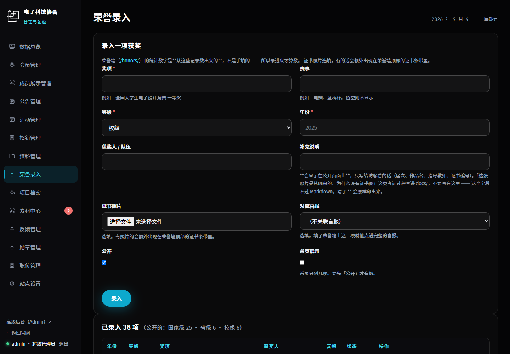

*图 10-1　荣誉的录入、公开和首页推荐是三个独立动作。*

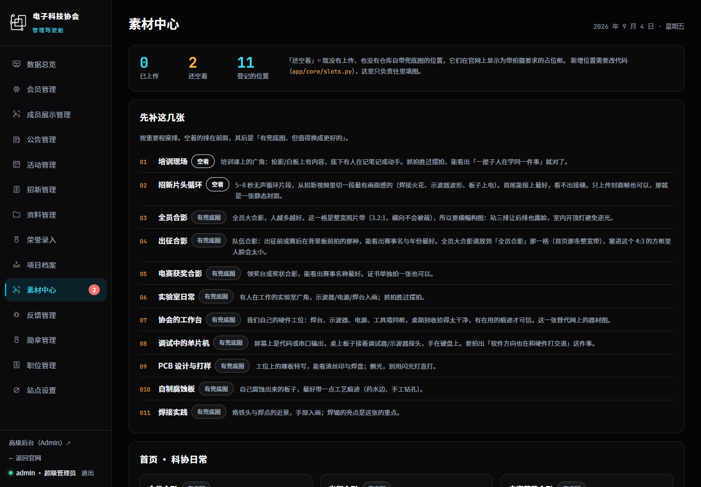

*图 10-2　素材按固定槽位维护，优先满足页面规定的构图。*

### 完成结果

荣誉与媒体素材在目标页面正确显示，移动端无关键主体被裁切。

### 常见错误

- **录入后首页不显示**：检查是否已公开并标记“放首页”。
- **移动端人物被裁掉**：重新设置焦点，不要通过拉伸图片解决。
- **版权或隐私不确定**：保持未公开，先获得授权。

## 11. 成员展示管理

### 操作目标

处理违规公开展示，同时保护成员的自愿公开权和私有草稿。

### 具体步骤

1. 进入“成员展示管理”，只查看当前公开或已下架的展示状态。
2. 管理员不能查看成员私有草稿和未公开素材，也不能代替成员发布。
3. 发现违规内容时先保存证据，填写具体、可执行的处理原因。
4. 点击“下架并限制发布”，公开页面和相关图片会停止新访问。
5. 成员可继续修改私有草稿；确认问题解决后管理员点击“解除限制”。
6. 解除限制不会自动恢复公开，必须由成员本人重新确认并发布。
7. 会员停用或降至资格门槛以下时展示会隐藏，恢复资格后仍需本人重新发布。

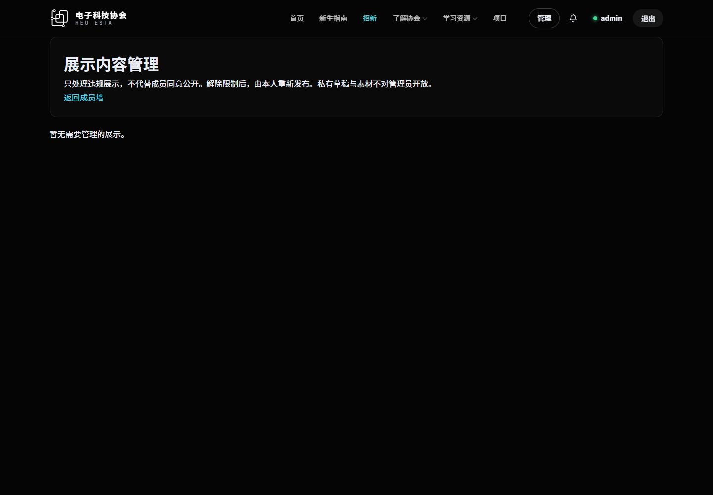

*图 11-1　管理操作针对违规公开内容，不代替成员同意。*

### 完成结果

违规内容被及时停止公开，下架原因可追溯，成员隐私草稿未被越权访问。

### 常见错误

- **只口头通知但未下架**：存在公开风险时先下架，再沟通修改。
- **解除限制后成员墙仍无卡片**：这是正常设计，需要本人重新发布。
- **管理员想帮成员直接公开**：不允许，公开同意必须由成员本人完成。

## 12. 职位与勋章管理

### 操作目标

搜索候选成员，准确记录现任/历任职位及任期，并授予或撤销勋章。

### 具体步骤

1. 进入“职位管理”，选择固定职位或创建普通自建职位。
2. 设置任职届次，例如“2026–2027 届”，并选择“现任任命”或“历史补录”。
3. 使用姓名、用户名、学号搜索候选；可按届别、学院和当前职位筛选。
4. 选择候选后核对完整姓名，再点击“任命”。不要只在输入框中留下文字。
5. 现任任命会更新当前职位；历史补录只记录经历，不授予现任职位权限。
6. 卸任只结束职位带来的权限，不降低会员等级，也不撤销单独授予的管理员权限。
7. 在“勋章管理”创建勋章后，按姓名/账号选择成员并填写授予原因。
8. 撤销或删除前确认影响范围；勋章可由成员选择是否显示在个人展示中。

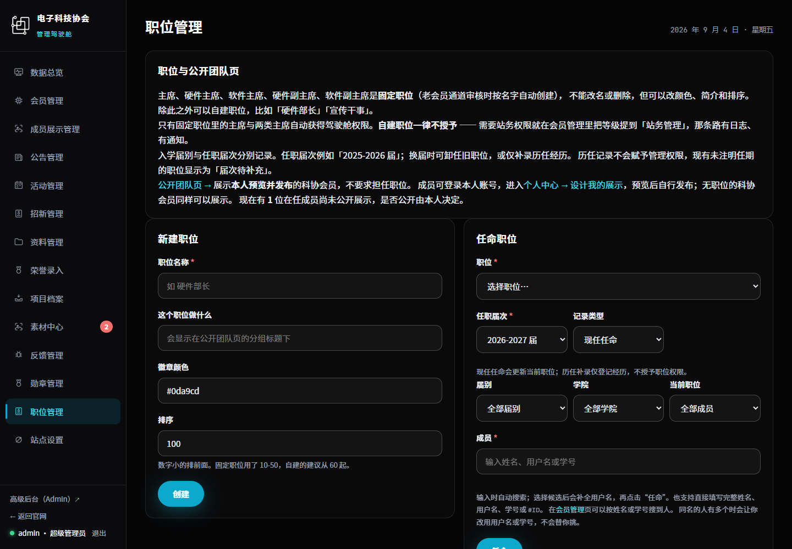

*图 12-1　任命区支持自动候选、筛选、任期和记录类型。*

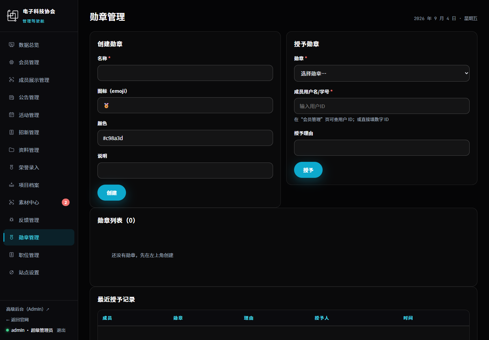

*图 12-2　勋章定义与授予记录分开维护。*

### 完成结果

现任职位、历任记录、任期和权限含义一致，勋章授予有明确理由。

### 常见错误

- **输入成员名字后直接提交失败**：必须从自动候选中选择，使系统得到准确成员 ID。
- **历史主席获得了现任权限**：检查是否误选“现任任命”，改为结束现任并补录历史。
- **卸任后仍能管理**：账号可能还有独立站务等级，需在会员管理单独调整。

## 13. 反馈与通知处理

### 操作目标

处理网站问题反馈，记录结论并确认用户侧通知。

### 具体步骤

1. 进入“反馈管理”，按未处理优先查看。
2. 阅读页面、角色、操作步骤、期望和实际结果；缺少信息时先回复补充要求。
3. 能复现的问题记录发生时间、版本和错误提示，避免在真实数据上反复试验。
4. 修复或给出明确答复后点击“标记已处理”。
5. 问题复发时使用“重新打开”，不要新建重复工单。
6. 删除只用于垃圾信息或确认无保留价值的重复记录。
7. 以普通用户视角检查通知中心是否收到回复。

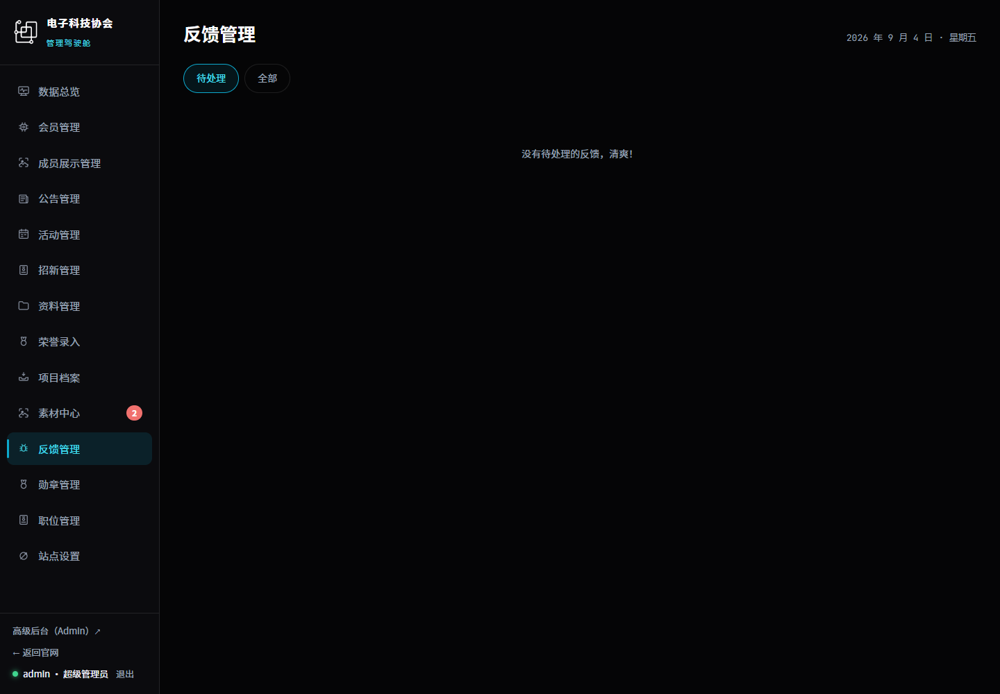

*图 13-1　反馈记录包含处理状态和回复操作，真实内容已遮挡。*

### 完成结果

工单状态与实际处理结果一致，用户能通过站内通知了解进展。

### 常见错误

- **无法复现就直接关闭**：先记录环境差异，并要求最小复现步骤。
- **修复后未验证用户权限**：使用与报告者相同等级测试，避免管理员视角误判。

## 14. 论坛与公共邮箱

### 操作目标

检查论坛 SSO、会员组、私密版块和公共邮箱同步是否正常。

### 具体步骤

1. 使用预备会员及以上测试账号从官网进入论坛，确认自动登录。
2. 招新成员不应获得论坛账号；若可以登录，应立即检查 SSO 等级映射。
3. 核对正式会员可见“公共邮箱”，游客、招新成员和预备会员不可见。
4. 在公共邮箱版块检查近期是否有新主题/回复；不要在手册或公开工单中复制邮件正文。
5. 具有 NodeBB 管理员权限时访问 `/admin/plugins/heuesta-mailbox`，检查连接账号、最后成功时间、同步数量、待重试和最近错误。
6. 邮箱插件只读，不提供发信、删信或标签修改；附件只显示元数据。
7. 令牌失效或同步持续报错时停止重复授权，把错误时间和摘要交给论坛运维负责人。

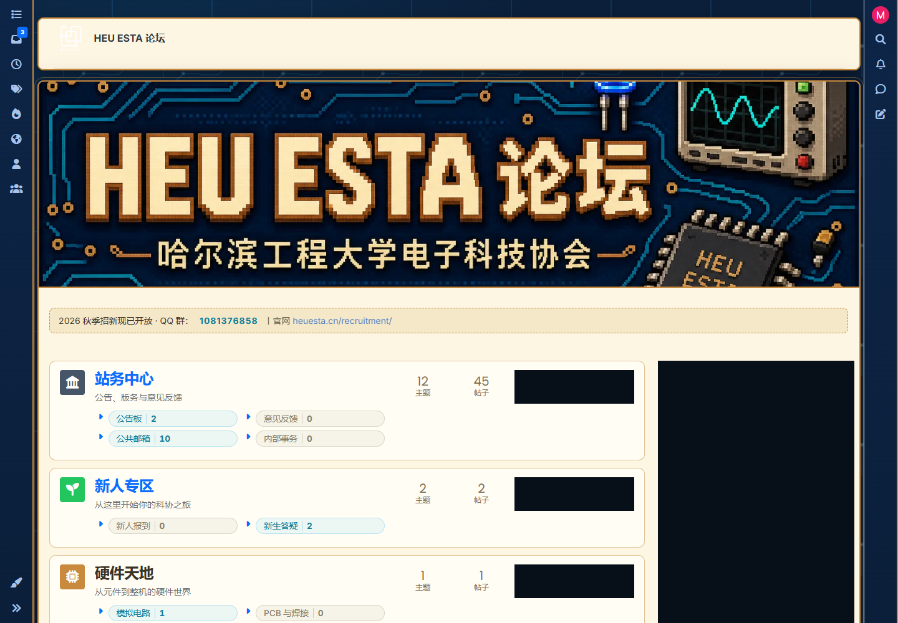

*图 14-1　论坛实际邮件主题和发件人已整体遮挡。*

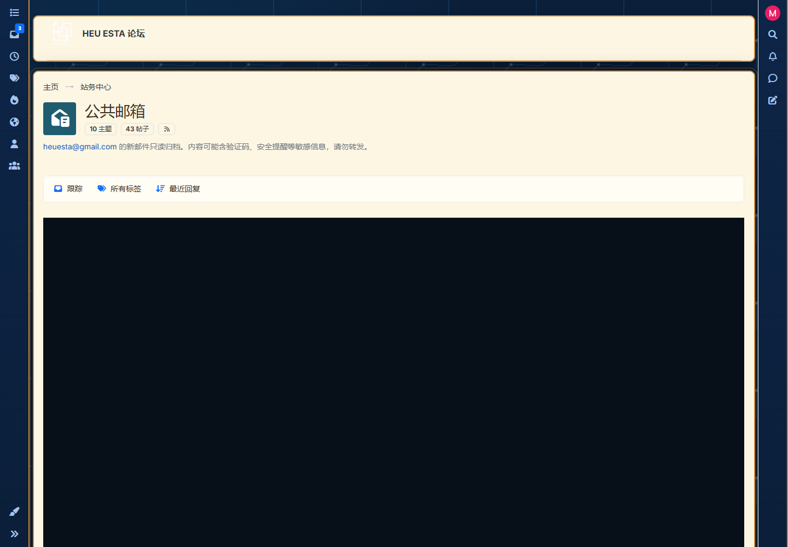

*图 14-2　公共邮箱明确提示可能含验证码和安全提醒，内容不得转发。*

### 完成结果

SSO 等级映射和公共邮箱可见性符合规则，异常能交给正确的论坛管理员处理。

### 常见错误

- **主站管理员无法进入论坛插件页**：主站与 NodeBB 管理权限独立。
- **公共邮箱有旧邮件但没有新邮件**：查看最后成功时间和错误，不要删除论坛归档来“重试”。
- **将邮件正文发到公开群求助**：禁止；只提供消息 ID、时间和脱敏错误摘要。

## 15. 站点设置与安全规则

### 操作目标

安全维护可公开配置，避免在日常内容管理中破坏域名、证书或外部服务。

### 具体步骤

1. 进入“站点设置”，阅读当前站名、联系信息、招新群号和页面配置。
2. 修改前记录原值、变更原因和负责人；一次只改一个可验证项。
3. 保存后分别用桌面、手机和未登录窗口检查显示结果。
4. 首页轮播/素材的启用、排序和删除应遵循素材管理规则。
5. 不在本界面或截图中记录服务器 IP、证书私钥、OAuth Secret、邮箱应用专用密码等凭据。
6. 域名、HTTPS、Nginx、Docker、数据库、备份和 CDN 操作统一按《维护手册》执行。

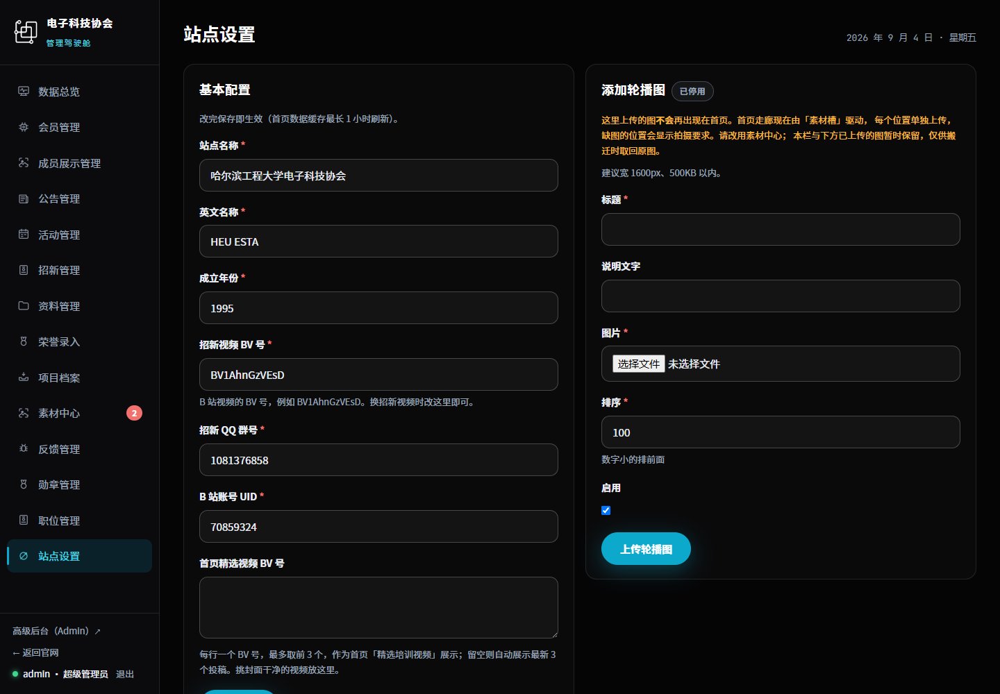

*图 15-1　站点设置只应修改已明确公开的业务配置。*

### 完成结果

配置变更有记录、有验证、可回退，关键外部服务未被日常操作误改。

### 常见错误

- **群号更新不一致**：同时核对首页、招新页、论坛横幅和二维码；二维码必须真机验证。
- **保存后旧内容仍出现**：先区分浏览器缓存、腾讯云 CDN 和应用缓存，再按维护手册处理。
- **要求在聊天中发送密钥**：拒绝明文传播，使用服务器受限环境变量文件和既定交接渠道。

## 16. 交接与故障处理

### 操作目标

建立可持续的日常检查与故障上报方式，防止“修一个问题引入更多问题”。

### 每日/每周检查清单

1. 访问官网、登录页、招新页和论坛，确认 HTTPS 正常。
2. 查看驾驶舱待审核、招新报名和未处理反馈。
3. 抽查一个普通成员账号的公告、资料、活动和论坛权限。
4. 检查公共邮箱最后同步时间和错误状态。
5. 检查备份任务与磁盘空间，具体命令见《维护手册》。
6. 发布内容或权限变更后，用目标角色和未登录窗口回归验证。

### 故障记录模板

- 发生时间（北京时间）：
- 页面 URL：
- 账号角色/等级（不要写密码）：
- 操作步骤：
- 期望结果：
- 实际结果与错误文字：
- 是否可稳定复现：
- 最近相关变更：
- 已采取措施：

### 分级处理

1. **内容错误**：先下架或修正文案，再核对缓存。
2. **权限泄露**：立即停止公开、保留证据并通知系统管理员，优先级最高。
3. **登录/邮件异常**：检查账号状态与邮箱可达性，再交给应用或邮件运维。
4. **502/504/证书/CDN/服务器异常**：停止在驾驶舱反复操作，按《维护手册》检查服务、日志与回退。
5. **数据误删**：停止后续写入，记录时间和对象，由运维评估备份恢复。

### 完成结果

接手人员能够进行常规管理，并在越过权限或运维边界前及时升级处理。

### 常见错误

- **管理员视角验证一切正常**：必须补测游客、招新成员、预备会员和科协会员视角。
- **直接在生产站反复试错**：先备份、使用演示数据、最小化变更并保留回退方案。
- **把临时绕行写进手册**：应先修复并回归，再记录正式流程。

## 内部参考

- 官网维护文档：仓库 `docs/维护手册.md`（如路径调整，以仓库索引为准）
- 本次手册验收与问题记录：`docs/manuals/验收与问题记录.md`
- 正式站：<https://heuesta.cn/>

本手册不得包含或外传真实会员隐私、管理员密码、服务器信息、密钥和完整公共邮箱内容。
