# HEU ESTA 老会员使用手册

哈尔滨工程大学电子科技协会（HEU ESTA）

本手册说明老会员身份恢复、审核、登录、会员功能、论坛和成员展示。截图来自 2026 年 9 月 4 日正式站，演示账号及素材均为临时数据，敏感字段已遮挡。

> 官网：<https://heuesta.cn/>
> 账号入口：<https://heuesta.cn/accounts/login/>
> 招新 QQ 群：**1081376858**

## 权限速览

| 身份 | 可登录 | 公开内容 | 会员资料/活动 | 论坛 SSO | 成员展示 |
|---|---:|---:|---:|---:|---:|
| 待审核老会员 | 否 | 可作为游客浏览 | 否 | 否 | 否 |
| 招新成员 | 是 | 是 | 否 | 否 | 否 |
| 预备会员 | 是 | 是 | 按可见等级 | 是 | 否 |
| 科协会员及以上 | 是 | 是 | 按可见等级 | 是 | 可自愿发布 |

职位、站务管理和系统管理员是不同概念。担任协会职位不会改变本人是否愿意公开展示；公开展示也不会授予任何管理权限。

## 1. 适用对象与账号选择

### 操作目标

判断应恢复老会员身份、注册新会员，还是找回已有账号。

### 具体步骤

1. 访问 <https://heuesta.cn/accounts/register/>。
2. 曾经是协会科协会员或主席团成员、目前没有可用网站账号时，选择“老会员身份恢复”。
3. 尚未加入过协会、准备参加本届招新的同学选择“新会员注册”。
4. 已经注册过相同邮箱、学号或手机号时，不要再次注册，返回登录页找回密码。
5. 不确定是否已有账号时，先尝试注册邮箱的验证码登录；仍无法确认再联系站务。

*图 1-1　两个通道的激活规则不同，老会员通道必须人工核验。*

### 完成结果

你已选择与真实身份相符的入口，不会产生重复档案。

### 常见错误

- **为了快速登录选择新会员通道**：这会得到招新成员身份，无法恢复原会员权限，应联系站务处理，不要再注册第三个账号。
- **忘记用户名就重新注册**：应使用注册邮箱重置密码或请站务查询。

## 2. 老会员注册准备

### 操作目标

准备足以让管理组核验历史身份的资料。

### 具体步骤

1. 准备真实姓名、本人学号、学院和实际入学届别。
2. 回忆原协会身份：科协会员、主席、硬件主席、软件主席、硬件副主席或软件副主席。
3. 准备常用邮箱、11 位手机号和 QQ 号。
4. 选择硬件、软件或自定义擅长方向；自定义方向需附说明。
5. 如原职务、届别或学号存在特殊情况，提前整理能够说明身份的非敏感信息，审核时按站务要求补充。

### 完成结果

你能一次填写完整申报，减少来回核验时间。

### 常见错误

- **职位名称与实际经历不一致**：按真实经历申报，管理员会在批准前修正。
- **毕业成员不知道届别怎么选**：选择实际入学年份，不选择毕业年份。

## 3. 逐步完成注册

### 操作目标

提交老会员身份恢复申请并建立待审核账号。

### 具体步骤

1. 在第一步填写姓名、学号、学院、届别和原协会身份。
2. 选择擅长方向；如选“自定义”，填写具体说明。
3. 点击“下一步”，填写邮箱、6 位验证码、手机号和 QQ。
4. 邮箱验证码有效 10 分钟，重发前需等待 60 秒；只使用最新一封邮件中的验证码。
5. 在第三步设置 4–20 位用户名和不少于 8 位的密码。
6. 阅读并勾选隐私说明，确认后提交。

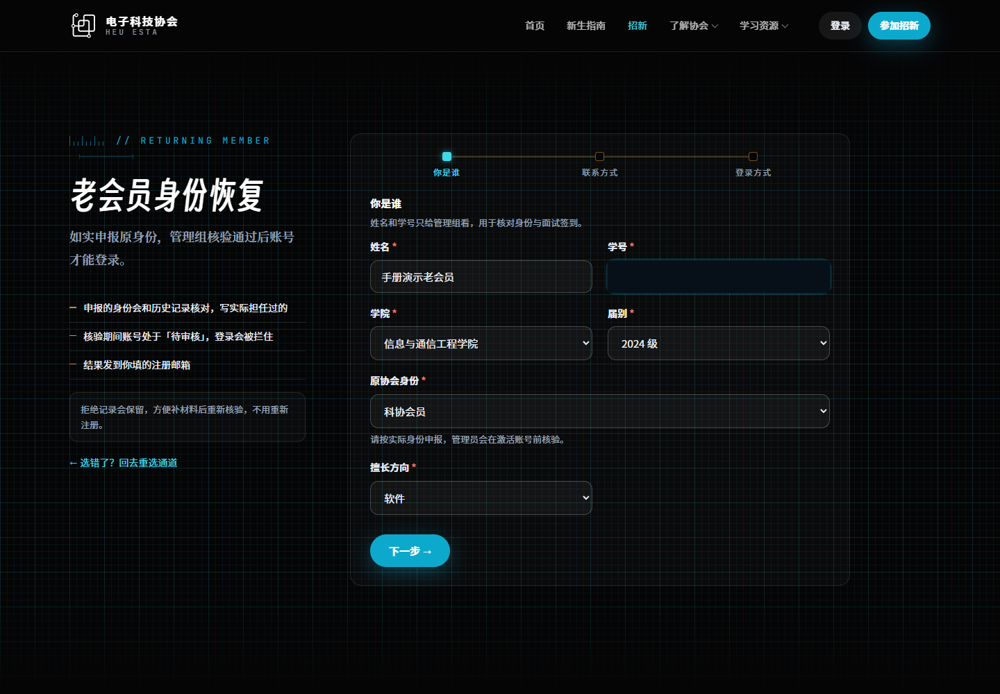

*图 3-1　老会员第一步比新会员多“原协会身份”。*

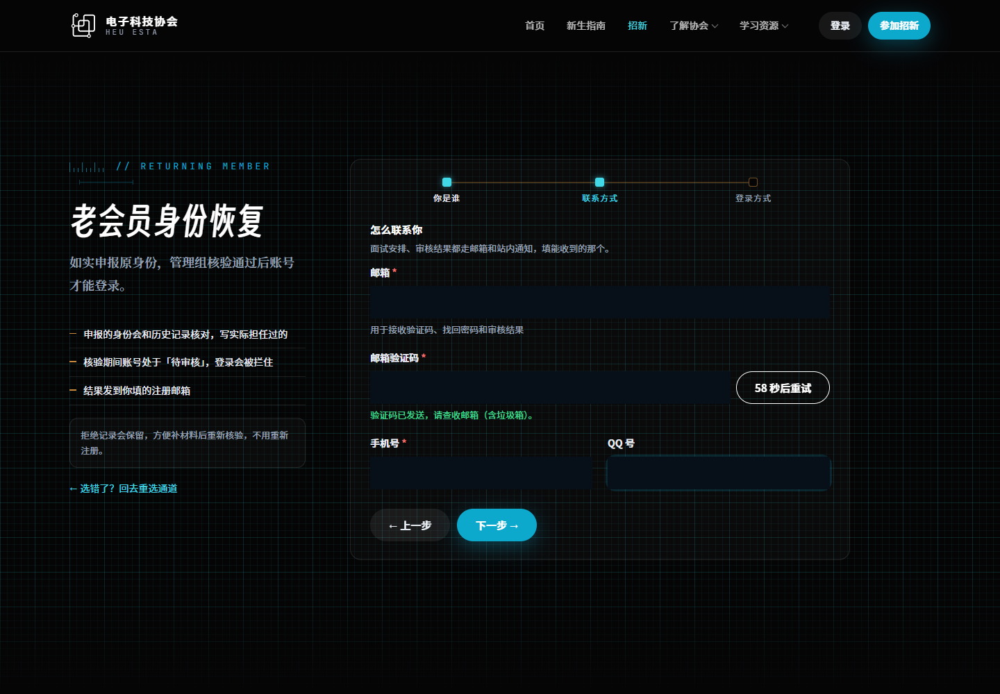

*图 3-2　审核结果会发送至注册邮箱，务必保证可收信。*

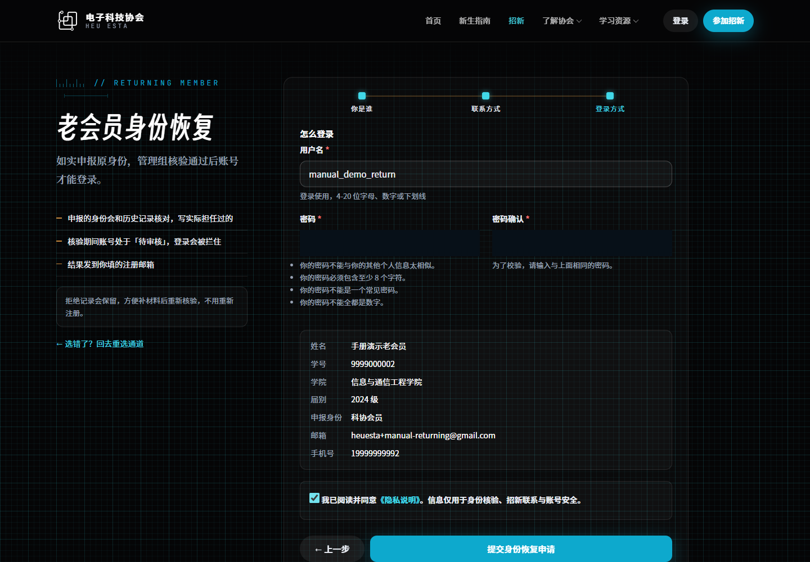

*图 3-3　最后设置登录账号并同意隐私说明。*

### 完成结果

页面显示“申请已提交”，账号处于待审核和停用状态。

### 常见错误

- **邮箱、学号或手机号重复**：说明已有档案，应找回原账号或联系站务合并处理。
- **验证码失败**：检查是否使用了最新验证码，连续错误 5 次后需重新获取。
- **原协会身份不在列表中**：选择最接近的身份，并在审核沟通中说明。

## 4. 等待管理员审核

### 操作目标

理解待审核期间的表现和收到审核结果后的处理方式。

### 具体步骤

1. 提交后阅读完成页上的“接下来”说明。
2. 保存用户名，但不要把密码发给任何人。
3. 等待管理组核对真实姓名、学号、届别和原身份。
4. 审核前尝试登录会看到“账号正在等待身份审核”，这是正常状态。
5. 审核结果会发送至注册邮箱；被拒记录不会立即删除，可以补充材料后重新审核。

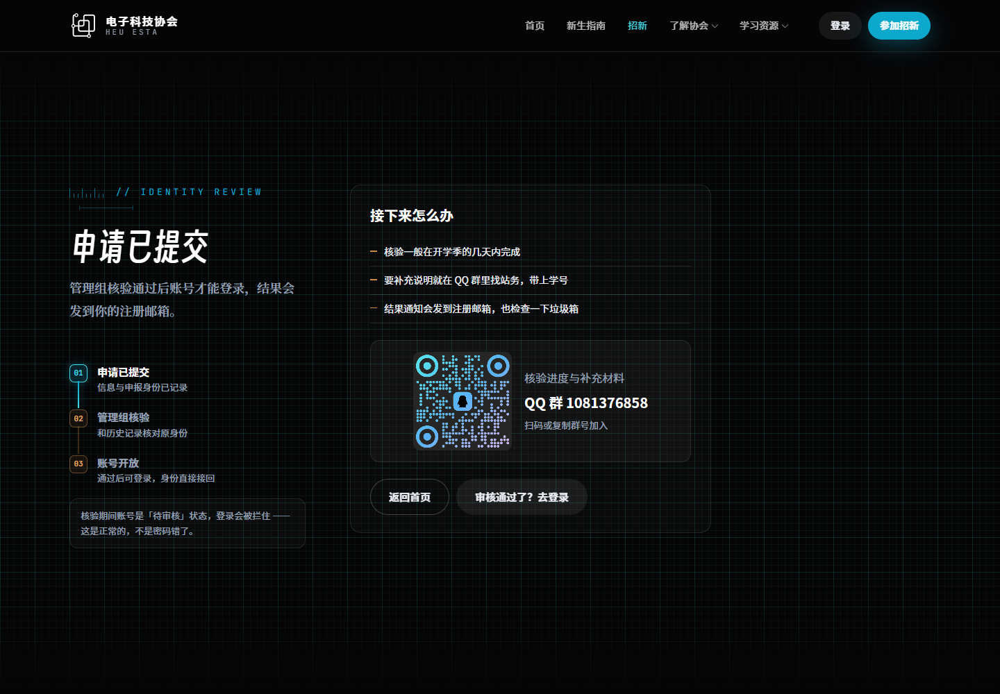

*图 4-1　完成页明确说明账号尚未激活。*

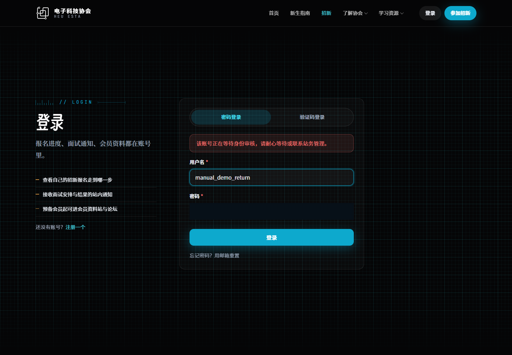

*图 4-2　审核前账号不能登录，不代表密码错误。*

### 完成结果

你知道当前账号仍在等待核验，并能通过邮箱或站务了解结果。

### 常见错误

- **反复重置密码仍不能登录**：待审核账号未激活，重置密码不会跳过审核。
- **长时间没有结果**：检查垃圾邮件后，在招新群或官网反馈中提供用户名和姓名，不要提供密码。
- **被拒后重新注册**：不要重复注册；联系站务补充材料并请求重新审核。

## 5. 首次登录与账号安全

### 操作目标

审核通过后安全登录，并掌握验证码登录、改密与退出。

### 具体步骤

1. 收到通过通知后打开 <https://heuesta.cn/accounts/login/>。
2. 使用用户名和密码登录；用户名不是姓名、学号或邮箱。
3. 不便输入密码时切换“验证码登录”，填写注册邮箱并获取验证码。
4. 忘记密码时进入 <https://heuesta.cn/accounts/forgot/>，验证邮箱后设置新密码。
5. 登录后可在个人中心点击“修改密码”；需输入旧密码和两次新密码。
6. 使用公共电脑后务必点击右上角“退出”。

*图 5-1　登录页支持密码和邮箱验证码两种方式。*

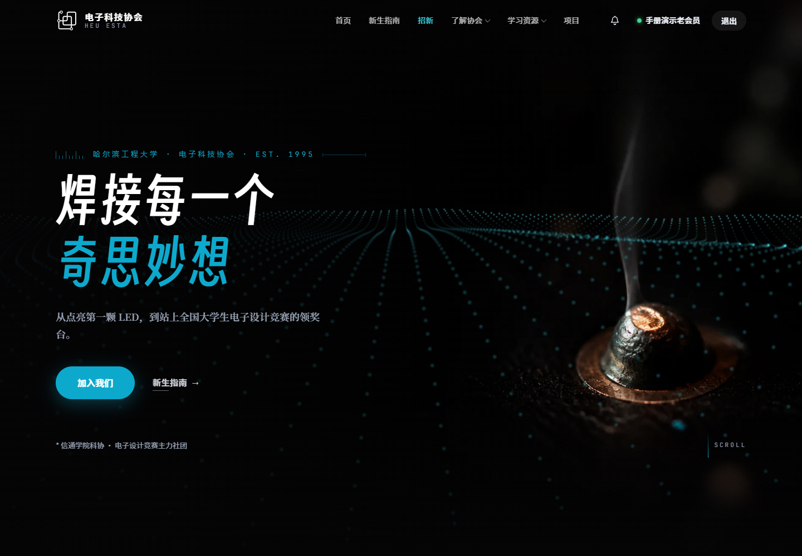

*图 5-2　成功登录后顶部显示当前账号。*

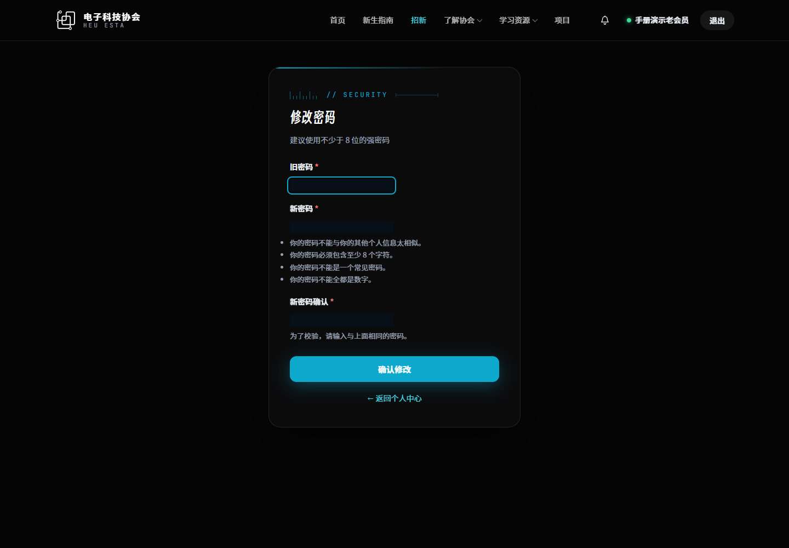

*图 5-3　新密码需满足页面列出的强度规则。*

### 完成结果

你可以正常登录、退出和恢复账号，不需要管理员知道你的密码。

### 常见错误

- **通过邮件已收到但仍提示待审核**：退出浏览器中的旧会话后重新登录；仍异常时联系站务。
- **验证码登录提示邮箱未注册**：确认邮箱与注册时完全一致。

## 6. 个人中心与资料维护

### 操作目标

核对会员等级、身份档案、任职经历和账号功能入口。

### 具体步骤

1. 登录后点击右上角账号名称进入个人中心。
2. 在工牌区核对等级、学院、届别、方向和积分。
3. 在右侧查看“我的成员展示”“我的勋章”“我的活动”和“我上传的资料”。
4. 点击“编辑资料”修改姓名、学院、届别、性别、生日、方向、QQ、手机和头像。
5. 学号、邮箱等唯一身份字段无法自行随意变更时，联系站务核验后处理。
6. 点击保存并返回个人中心确认新信息已经生效。

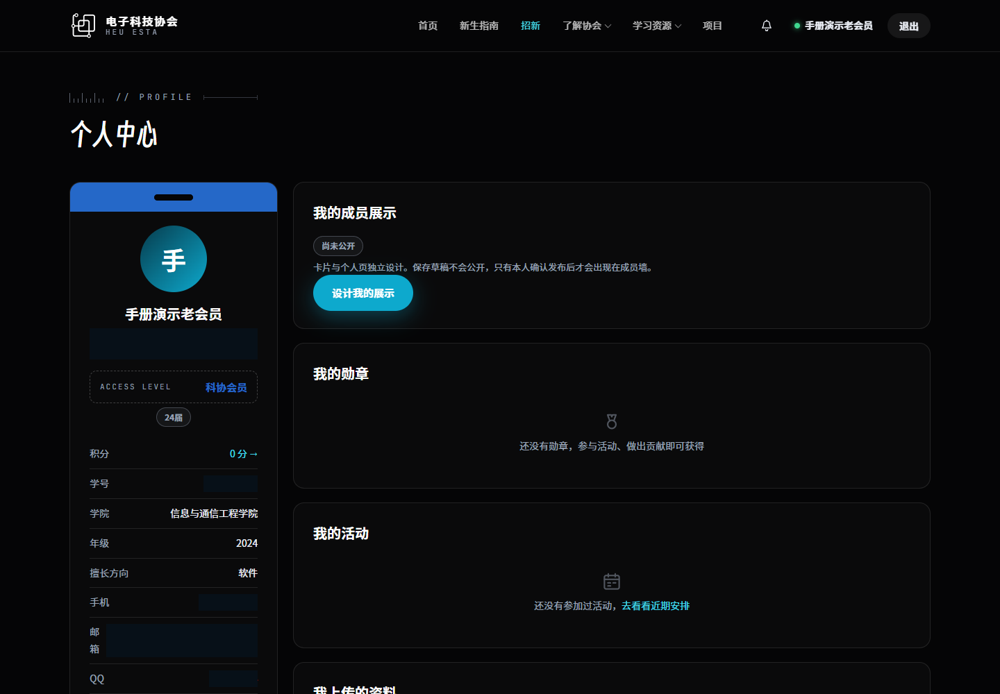

*图 6-1　个人中心同时展示账号档案和可用功能，私密字段已遮挡。*

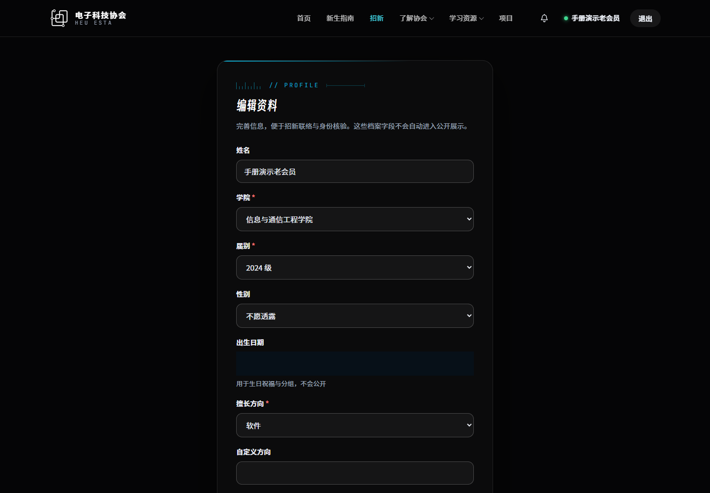

*图 6-2　生日用于站内祝福与分组，不会自动公开。*

### 完成结果

个人档案与实际情况一致，能够找到会员功能和展示编辑入口。

### 常见错误

- **保存后自定义方向消失**：只有方向选择“自定义”时才保留补充说明。
- **头像上传失败**：使用常见静态图片并控制文件大小；不要上传 SVG 或动画文件。
- **看不到“设计我的展示”**：只有已激活的科协会员及以上可使用，预备会员暂不开放。

## 7. 通知与权限说明

### 操作目标

查看站内消息，并理解等级、职位和管理授权之间的差异。

### 具体步骤

1. 点击顶部铃铛进入通知中心。
2. 使用“全部”和“未读”筛选消息。
3. 等级变化、勋章授予、反馈回复和部分活动消息会出现在此处。
4. “科协会员”代表会员等级；主席等为独立职位记录，并带任期。
5. 站务管理和系统管理员是独立授权。普通会员或副主席不会仅因职位自动获得后台权限。

*图 7-1　没有通知时页面会显示清晰的空状态。*

### 完成结果

你能判断当前会员等级和可用功能，不会把公开职位误认为后台权限。

### 常见错误

- **任职记录存在但无法进入管理驾驶舱**：职位与站务权限解耦，只有获授权账号可管理。
- **看不到应有资源**：先确认等级，再退出重新登录；仍异常时联系站务核验可见等级。

## 8. 公告与学习资源

### 操作目标

浏览与本人等级匹配的公告和资料，并安全下载文件。

### 具体步骤

1. 从顶部导航进入公告或“学习资源”。
2. 使用分类与关键词查找所需资料。
3. 打开条目后先查看标题、说明、上传者和可见等级。
4. 只下载你有权访问的文件，不把会员内部资料转发到公开平台。
5. 下载异常时记录资料标题和页面地址，向站务反馈。

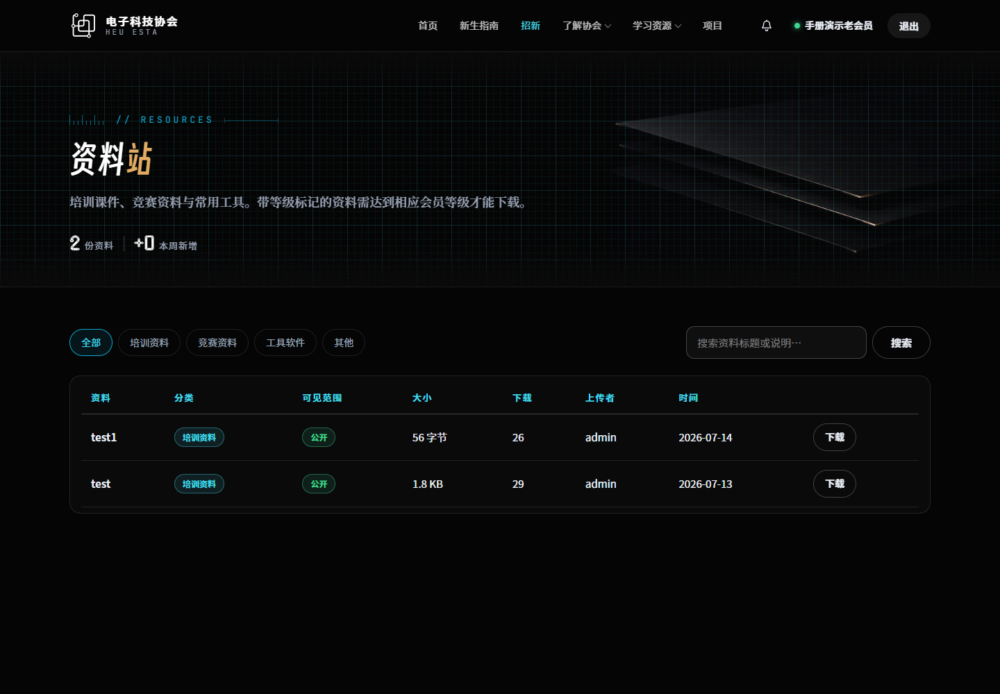

*图 8-1　资料列表会按当前会员等级进行权限过滤。*

### 完成结果

你能找到并下载被授权的学习资源，同时遵守内部资料边界。

### 常见错误

- **直接打开旧下载链接显示 403/404**：登录状态或可见等级可能变化，应从资料列表重新进入。
- **文件无法预览**：部分资料仅提供下载，请使用本地兼容软件打开。

## 9. 活动与项目

### 操作目标

报名活动、查看签到信息，并浏览协会项目和公开作品。

### 具体步骤

1. 进入“活动”，查看开始时间、地点、人数和报名状态。
2. 在报名开放且有权限时点击报名；需要取消时在截止前使用取消入口。
3. 活动现场按组织者要求完成签到，个人中心会显示报名与签到状态。
4. 进入“项目”浏览项目档案、阶段、成员与公开作品。
5. 项目公开展示不等于授予编辑权限；加入项目需由项目负责人或管理员维护成员关系。

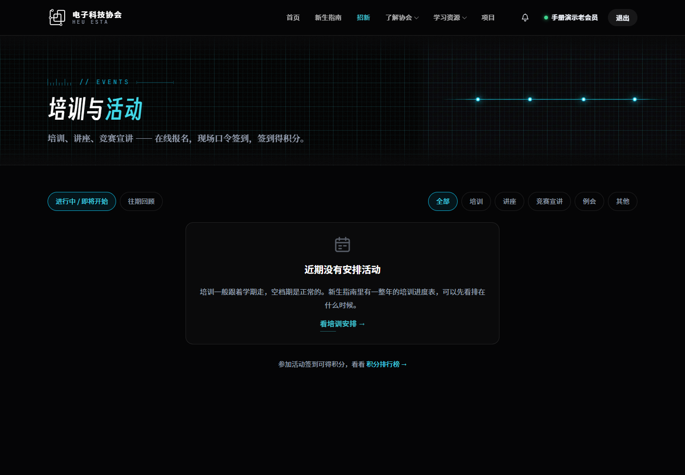

*图 9-1　活动页集中展示报名入口和时间安排。*

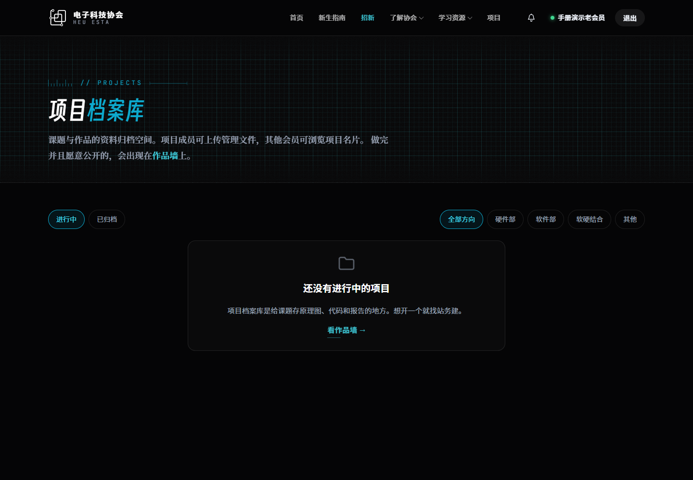

*图 9-2　项目档案用于持续记录作品和进度。*

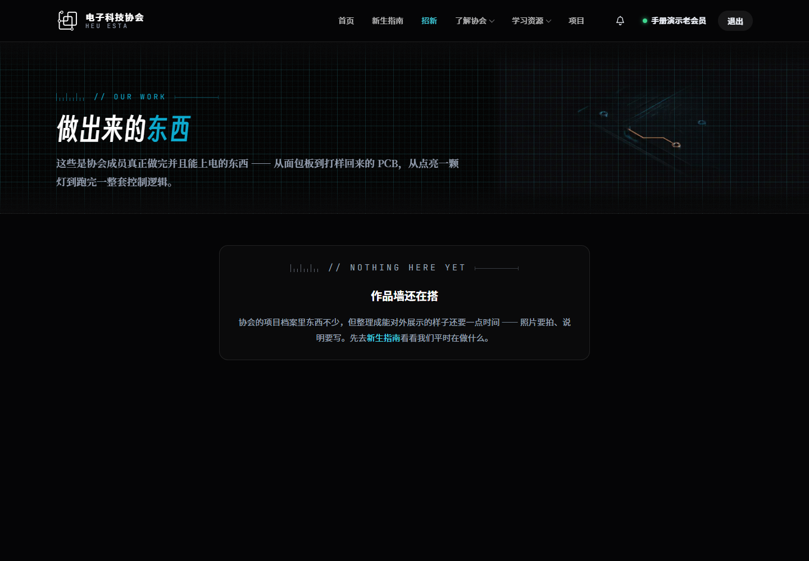

*图 9-3　公开作品可被成员展示引用，但不会因此改变项目权限。*

### 完成结果

你能够完成日常活动报名、查看项目，并理解项目成员权限边界。

### 常见错误

- **活动按钮不可用**：可能未发布、已满员、已结束或对当前等级不可见。
- **能看到项目但不能编辑**：浏览权限与项目成员权限不同，属于正常行为。

## 10. 论坛使用

### 操作目标

通过官网 SSO 登录论坛，并理解私密版块与公共邮箱的可见范围。

### 具体步骤

1. 先登录官网，再从官网导航进入论坛；不要在论坛重复注册账号。
2. 预备会员及以上会通过 SSO 自动建立或登录论坛账号。
3. 论坛版块按会员组授权，无法发现的私密版块通常表示当前组无权限。
4. “公共邮箱”只向正式会员、站务和管理员开放；内容可能包含验证码、安全提醒等敏感邮件，禁止转发。
5. 公共邮箱为只读归档：同一发件人一个主题，新邮件追加为回复，附件只显示元数据。

*图 10-1　官网登录后进入论坛，截图已遮挡真实邮件主题。*

*图 10-2　公共邮箱版块会持续提示保密风险，主题内容已整体遮挡。*

### 完成结果

你能够使用官网身份进入论坛，并知晓公共邮箱内容不得外传。

### 常见错误

- **论坛仍显示游客**：退出官网和论坛后重新登录，再从官网入口进入。
- **招新成员无法登录论坛**：这是正常权限限制，一面通过成为预备会员后开放。
- **公共邮箱为空或无权限**：确认已经成为科协会员；同步异常应联系论坛管理员。

## 11. 设计成员展示

### 操作目标

创建私有草稿，选择卡片和个人页模板，并安全管理图片素材。

### 具体步骤

1. 在个人中心点击“设计我的展示”。首次进入始终是私有草稿，不会自动公开。
2. 在“版式与身份”选择卡片模板，填写独立公开昵称、届别和方向；这些字段不会修改入会档案。
3. 上传展示头像，或主动复制账号头像；两者之后独立管理。
4. 在“背景与照片”选择本人照片、预设渐变或纯色。照片可调整焦点、缩放、模糊和安全遮罩。
5. 在“内容与排序”填写不超过 60 字的短介绍和最多 4 个标签，启用最多 3 个卡片模块。
6. 在“个人页面”选择独立模板，设置自我介绍、技能、封面和模块顺序。
7. 添加最多 6 件作品、6 张图集图片和 6 条 HTTPS 外部链接。
8. 打开“素材库”检查素材用途。移除引用不等于删除图片，草稿或公开版本正在使用的素材不能删除。
9. 随时点击“保存草稿”；顶部出现“草稿已保存”后再离开页面。

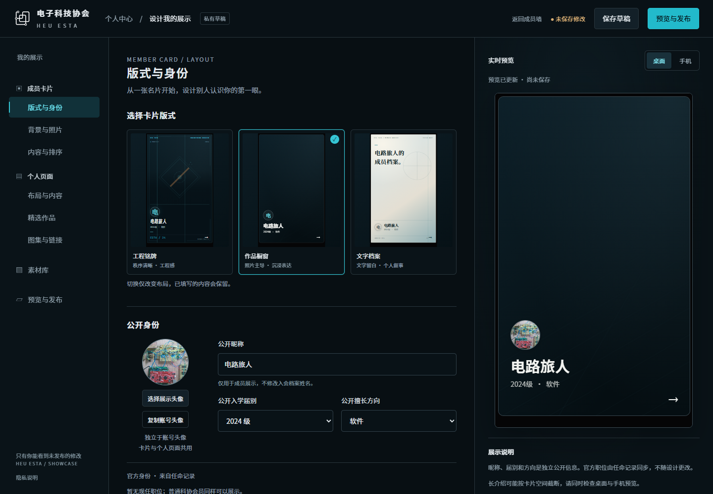

*图 11-1　卡片模板只改变排版，不会清空已填内容。*

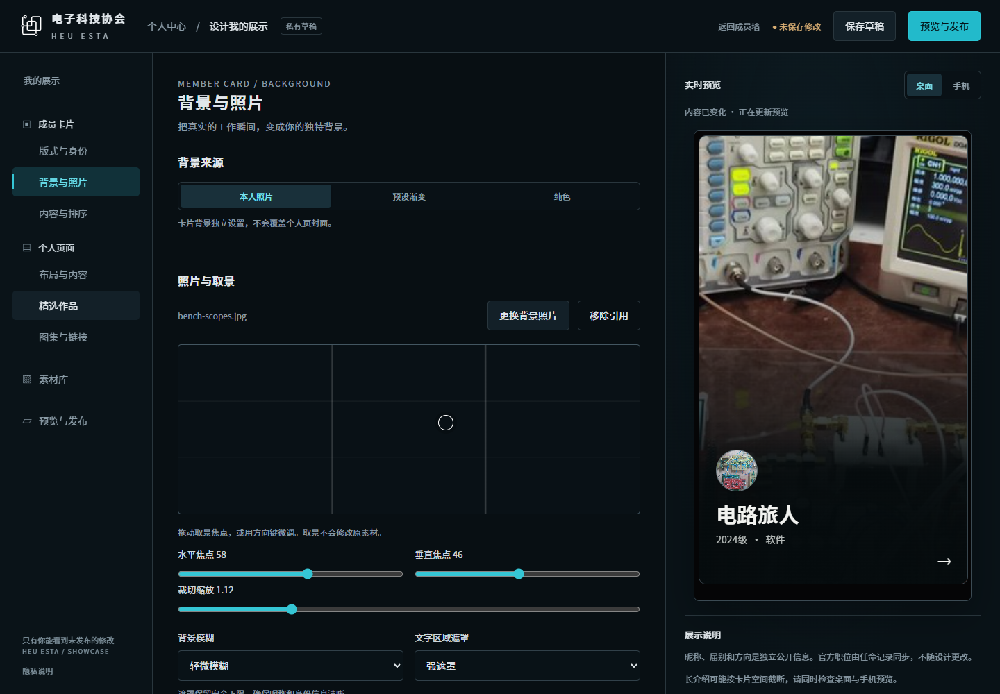

*图 11-2　工作照片可调整焦点、缩放、模糊和文字遮罩。*

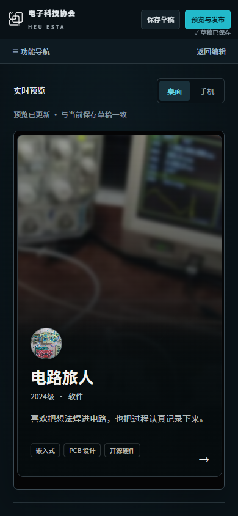

*图 11-3　手机端使用独立预览面板，不依赖缩小桌面页面。*

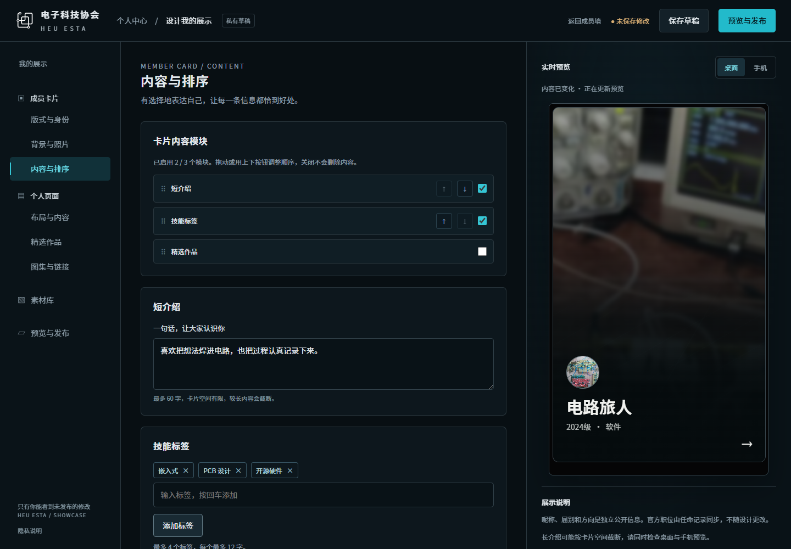

*图 11-4　模块可关闭和排序，关闭不会删除草稿内容。*

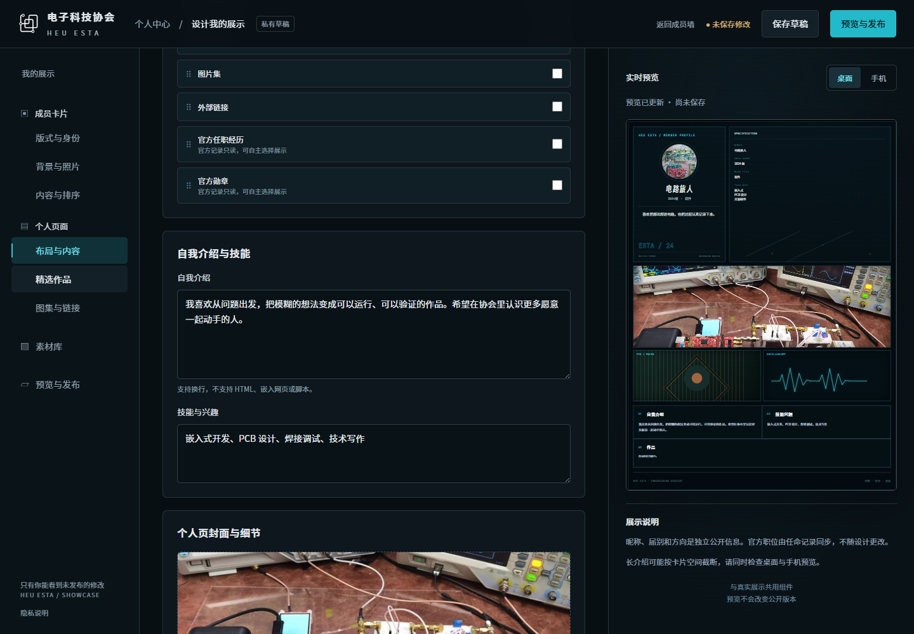

*图 11-5　个人页模板和卡片模板相互独立。*

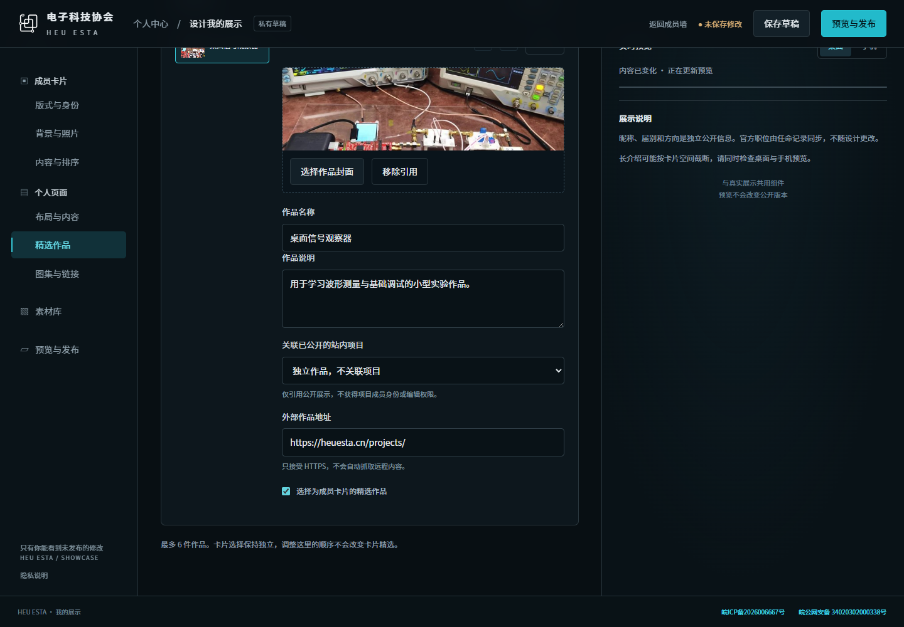

*图 11-6　作品可独立填写，也可引用已公开站内项目。*

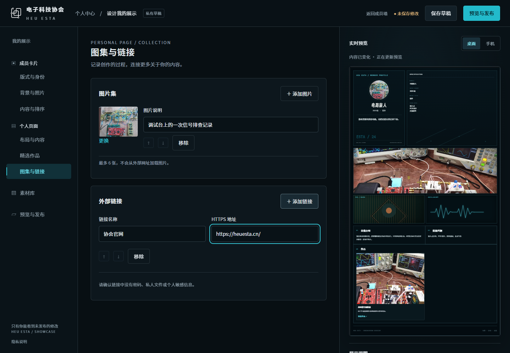

*图 11-7　外部链接只允许 HTTPS，网站不会抓取远端内容。*

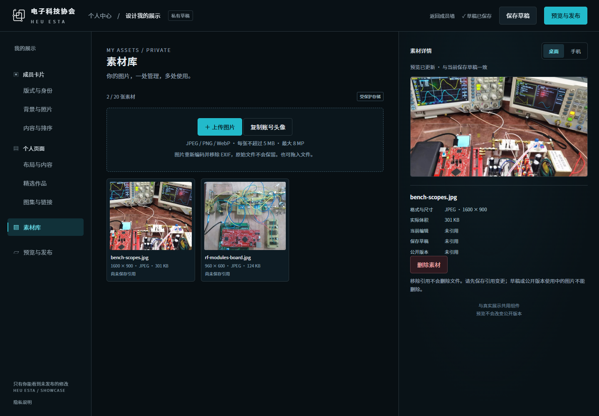

*图 11-8　素材经重新编码并移除 EXIF，草稿素材仅本人可访问。*

### 完成结果

展示草稿已保存，桌面和手机预览均符合预期，但互联网仍不可见。

### 常见错误

- **关闭模块后内容不见了**：只是停止展示，文字仍保留在草稿中。
- **删除素材按钮不可用**：先从所有位置移除引用、保存草稿，并确认公开版本也未使用。
- **上传失败**：仅支持静态 JPEG、PNG、WebP；单图不超过 5 MB、解码不超过 8 MP，每人最多 20 张。
- **切换模板后图片构图变化**：重新检查焦点和移动端预览，原图不会被修改。

## 12. 发布与隐私管理

### 操作目标

在充分确认后公开展示，并能安全更新、撤回或处理管理员下架。

### 具体步骤

1. 进入“预览与发布”，同时检查成员卡片和个人展示页。
2. 如果右侧提示“未保存修改”，先点击保存并等待双预览更新。
3. 确认公开昵称、图片、自填文字和链接可以面向互联网公开。
4. 勾选公开说明，再点击“确认发布我的展示”。进入本页本身不会自动发布。
5. 发布后打开成员墙和个人公开页，检查图片、文字、标签和官方身份。
6. 后续编辑只改变私有草稿，必须再次发布才会替换公开版本。
7. 需要停止公开时点击“撤回公开展示”并二次确认；草稿会保留，公开图片随引用失效。
8. 如被管理员下架，可继续编辑草稿；管理员解除限制后仍需本人重新发布。

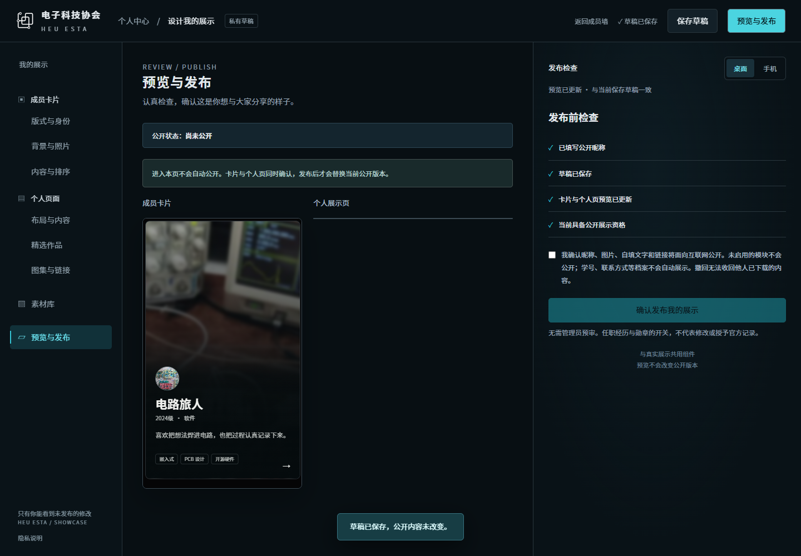

*图 12-1　发布前必须满足昵称、保存、双预览和资格检查。*

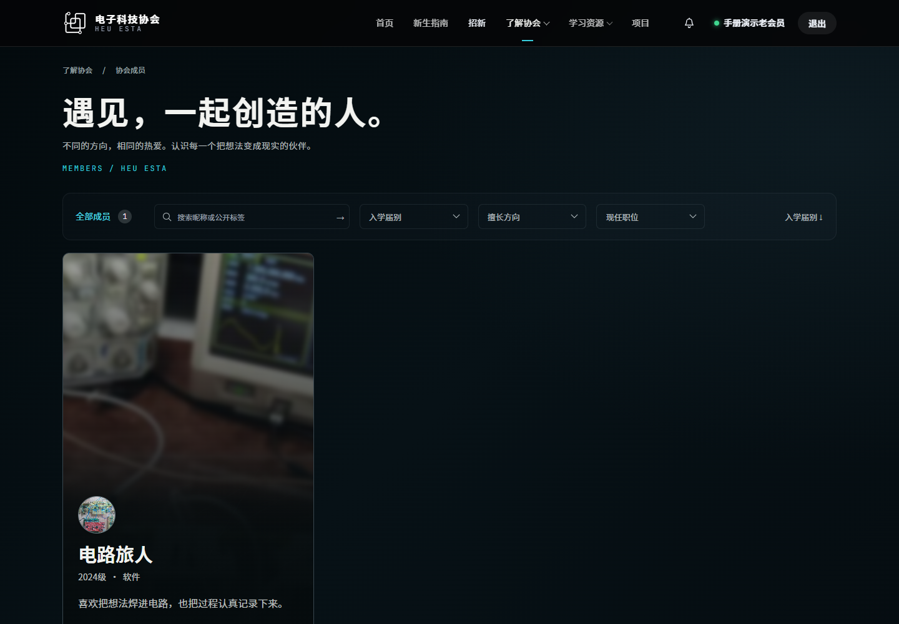

*图 12-2　发布后卡片出现在成员墙；演示展示随后已撤回。*

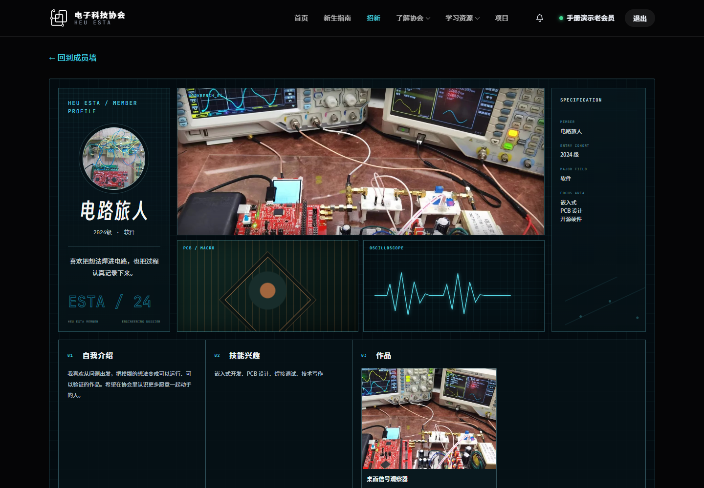

*图 12-3　个人页只使用公开字段，不包含学号和联系方式。*

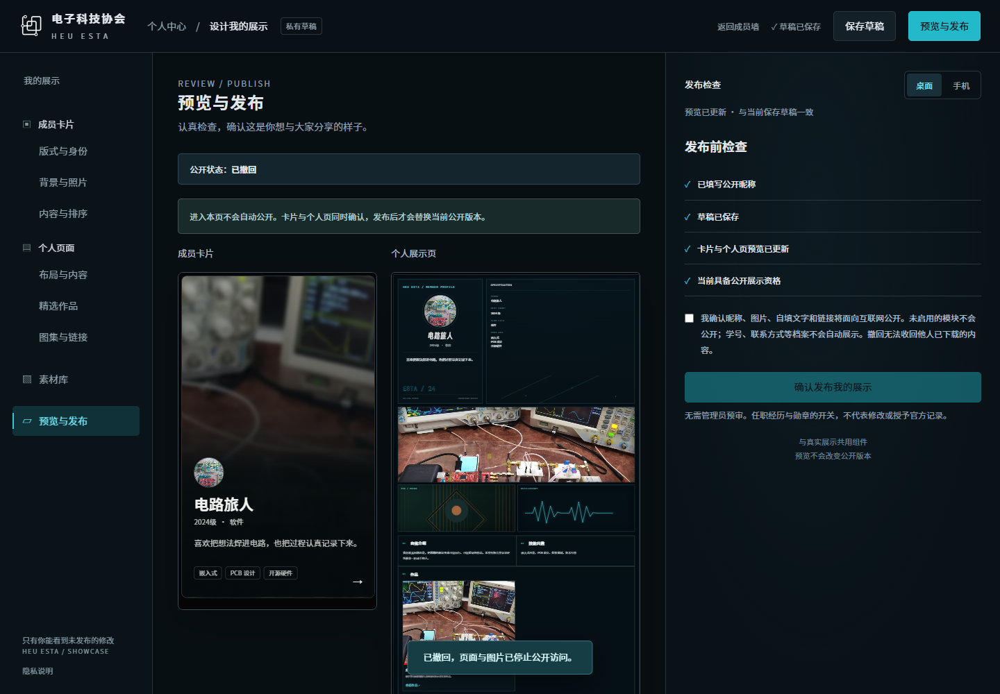

*图 12-4　撤回保留草稿，但页面和图片停止公开访问。*

### 完成结果

你能自主控制公开、更新和撤回，不需要管理员代替你同意公开。

### 常见错误

- **发布按钮不可用**：检查是否仍有未保存修改、最新预览是否完成、公开说明是否勾选。
- **撤回后搜索引擎仍有旧缩略图**：网站会拒绝新访问，但无法收回他人或搜索引擎已缓存、已下载的内容。
- **官方职位显示错误**：个人不能编辑官方记录，应联系站务更正任命与任期。

## 13. 常见问题与求助

### 操作目标

快速解决账号、权限、论坛和图片问题，并向站务提供可复现信息。

### 常见问题速查

| 问题 | 首选处理 |
|---|---|
| 老会员注册后不能登录 | 等待管理员审核，不要反复改密 |
| 审核邮件未收到 | 查垃圾箱，并提供用户名请站务查询 |
| 验证码收不到 | 确认邮箱、等待 60 秒、检查每日额度 |
| 资料重复 | 停止注册，找回原账号或联系站务 |
| 会员资源无权限 | 核对等级和条目可见范围 |
| 论坛显示游客 | 官网重新登录后从官网进入论坛 |
| 图片上传失败 | 检查格式、5 MB、8 MP 和 20 张上限 |
| 展示没有更新 | 保存草稿后需要再次发布 |
| 展示被下架 | 查看原因，修改草稿并联系管理员解除限制 |

### 求助时提供

1. 发生时间和页面网址。
2. 账号用户名及当前显示的会员等级。
3. 从进入页面开始的完整操作步骤。
4. 页面错误文字或已遮挡隐私的截图。
5. 浏览器和设备类型。

### 不要提供

密码、邮箱验证码、Cookie、会话链接、身份证件原图或与问题无关的私密资料。

### 联系入口

- 官网反馈：<https://heuesta.cn/feedback/>
- 招新 QQ 群：**1081376858**
- 官网：<https://heuesta.cn/>
